# Design Document: Financial Advisor Feature (Agent Delta)

## Overview

The Financial Advisor Feature (Agent Delta) transforms BethNa AI from a professional trading platform into an inclusive financial advisor accessible to beginners. This comprehensive system includes a modern design system with GSAP animations, AI-powered onboarding, multi-model routing, persistent user memory, and intuitive chat interfaces.

The feature prioritizes visual excellence through a glassmorphism design system, smooth GSAP-powered animations, and responsive layouts that work seamlessly across all devices. The technical architecture supports scalable AI interactions with intelligent model routing and persistent user context.

## Architecture

### System Architecture

```mermaid
flowchart TB
    subgraph Frontend["Frontend Layer"]
        UI["🎨 Design System"]
        Chat["💬 Chat Interface"]
        Dashboard["📊 Simple Dashboard"]
        Onboarding["🚀 Onboarding Flow"]
    end

    subgraph AgentDelta["Agent Delta Core"]
        Router["🧠 Multi-Model Router"]
        Memory["💾 User Memory System"]
        Context["📋 Context Builder"]
        Profiler["🎯 Risk Profiler"]
    end

    subgraph AIModels["AI Models (OpenRouter)"]
        Llama["🦙 Llama 3.3 70B"]
        MiMo["🏆 MiMo-V2-Flash"]
        DeepSeek["🔢 DeepSeek R1"]
        Nemotron["📊 Nemotron VL"]
        Chimera["🧩 R1T Chimera"]
    end

    subgraph Storage["Data Layer"]
        LocalStorage["💽 Local Storage"]
        IndexedDB["🗄️ IndexedDB"]
        SessionCache["⚡ Session Cache"]
    end

    subgraph Integration["Integration Layer"]
        Alpha["🧠 Agent Alpha"]
        Beta["⚡ Agent Beta"]
        Gamma["📢 Agent Gamma"]
        Blockchain["⛓️ Blockchain"]
    end

    UI --> Chat
    Chat --> Router
    Router --> AIModels
    Router --> Memory
    Memory --> Storage
    Context --> Memory
    Profiler --> Context
    AgentDelta --> Integration
```



### Component Hierarchy

```
FinancialAdvisorApp/
├── DesignSystem/
│   ├── ColorPalette
│   ├── GlassComponents
│   ├── BentoGrid
│   ├── Buttons
│   └── Animations (GSAP)
├── OnboardingSystem/
│   ├── WelcomeScreen
│   ├── ConversationalSteps
│   ├── ProgressIndicator
│   └── RiskProfiler
├── ChatInterface/
│   ├── MessageBubbles
│   ├── HistorySidebar
│   ├── InputArea
│   └── QuickActions
├── SimpleDashboard/
│   ├── PortfolioOverview
│   ├── ProgressBars
│   ├── AIStatusCard
│   └── ActionButtons
└── CoreServices/
    ├── MultiModelRouter
    ├── UserMemoryManager
    ├── ContextBuilder
    └── AgentIntegration
```

## Components and Interfaces

### 1. Enhanced Design System

#### Color Palette (Updated)

```typescript
// Enhanced BethNa Color System
export const bethnaColors = {
  // Primary Brand Colors
  primary: {
    lime: '#C1FF72',      // Main brand color
    limeHover: '#B8FF5C',  // Hover state
    limeDark: '#9FE84A',   // Dark variant
  },
  
  // Background System
  background: {
    dark: '#0A0A0B',       // Main dark background
    darker: '#050506',     // Deeper dark
    card: '#0F0F11',       // Card backgrounds
    glass: 'rgba(15, 15, 17, 0.7)', // Glass effect
  },
  
  // Glass Effect Colors
  glass: {
    bg: 'rgba(255, 255, 255, 0.05)',
    border: 'rgba(193, 255, 114, 0.15)',
    shadow: 'rgba(193, 255, 114, 0.1)',
    glow: 'rgba(193, 255, 114, 0.3)',
  },
  
  // Status Colors
  status: {
    success: '#22C55E',
    warning: '#F59E0B', 
    error: '#EF4444',
    info: '#3B82F6',
  },
  
  // Text Colors
  text: {
    primary: '#FFFFFF',
    secondary: '#A3A3A3',
    muted: '#6B7280',
    accent: '#C1FF72',
  }
} as const;

// CSS Variables Implementation
export const cssVariables = `
:root {
  --bethna-primary: ${bethnaColors.primary.lime};
  --bethna-primary-hover: ${bethnaColors.primary.limeHover};
  --bethna-bg-dark: ${bethnaColors.background.dark};
  --bethna-bg-card: ${bethnaColors.background.card};
  --bethna-glass-bg: ${bethnaColors.glass.bg};
  --bethna-glass-border: ${bethnaColors.glass.border};
  --bethna-glass-glow: ${bethnaColors.glass.glow};
  
  /* Animation Variables */
  --animation-fast: 150ms;
  --animation-normal: 300ms;
  --animation-slow: 500ms;
  
  /* Spacing Scale */
  --spacing-xs: 0.5rem;
  --spacing-sm: 1rem;
  --spacing-md: 1.5rem;
  --spacing-lg: 2rem;
  --spacing-xl: 3rem;
}
`;
```

#### Glass Components

```typescript
// Enhanced Glass Card Component
interface GlassCardProps {
  variant: 'default' | 'subtle' | 'strong' | 'glow' | 'accent';
  blur: 'sm' | 'md' | 'lg' | 'xl';
  glow: 'none' | 'primary' | 'success' | 'accent';
  animated: boolean;
  hoverEffect: 'scale' | 'glow' | 'lift' | 'none';
  children: React.ReactNode;
}

// Glass Card Variants
const glassVariants = {
  default: {
    background: 'rgba(15, 15, 17, 0.7)',
    border: '1px solid rgba(193, 255, 114, 0.15)',
    backdropFilter: 'blur(12px) saturate(180%)',
  },
  subtle: {
    background: 'rgba(15, 15, 17, 0.5)',
    border: '1px solid rgba(255, 255, 255, 0.05)',
    backdropFilter: 'blur(8px) saturate(150%)',
  },
  strong: {
    background: 'rgba(15, 15, 17, 0.9)',
    border: '1px solid rgba(193, 255, 114, 0.25)',
    backdropFilter: 'blur(20px) saturate(200%)',
  },
  glow: {
    background: 'rgba(15, 15, 17, 0.7)',
    border: '1px solid rgba(193, 255, 114, 0.3)',
    backdropFilter: 'blur(12px) saturate(180%)',
    boxShadow: '0 0 40px rgba(193, 255, 114, 0.2)',
  },
  accent: {
    background: 'rgba(193, 255, 114, 0.1)',
    border: '1px solid rgba(193, 255, 114, 0.3)',
    backdropFilter: 'blur(12px) saturate(180%)',
  }
};
```

#### Bento Grid System

```typescript
// Enhanced Bento Grid Component
interface BentoGridProps {
  columns: 1 | 2 | 3 | 4 | 6 | 12;
  gap: 'sm' | 'md' | 'lg' | 'xl';
  responsive: boolean;
  autoFit: boolean;
  children: React.ReactNode;
}

interface BentoItemProps {
  colSpan: number;
  rowSpan: number;
  priority: 'low' | 'medium' | 'high';
  animated: boolean;
  children: React.ReactNode;
}

// Grid System Configuration
const bentoConfig = {
  breakpoints: {
    mobile: '320px',
    tablet: '768px', 
    desktop: '1024px',
    wide: '1440px',
  },
  columns: {
    mobile: 1,
    tablet: 2,
    desktop: 3,
    wide: 4,
  },
  gaps: {
    sm: '0.5rem',
    md: '1rem',
    lg: '1.5rem',
    xl: '2rem',
  }
};
```

#### Button System

```typescript
// Enhanced Button Component
interface ButtonProps {
  variant: 'default' | 'glass' | 'outline' | 'glow' | 'gradient' | 'minimal';
  size: 'sm' | 'md' | 'lg' | 'xl' | 'icon';
  animation: 'none' | 'scale' | 'glow' | 'shimmer' | 'pulse';
  loading: boolean;
  disabled: boolean;
  children: React.ReactNode;
}

// Button Variants with GSAP Integration
const buttonVariants = {
  default: {
    background: 'var(--bethna-primary)',
    color: '#0A0A0B',
    border: 'none',
    hover: {
      background: 'var(--bethna-primary-hover)',
      scale: 1.02,
      duration: 0.2,
    }
  },
  glass: {
    background: 'rgba(15, 15, 17, 0.7)',
    color: '#FFFFFF',
    border: '1px solid rgba(193, 255, 114, 0.15)',
    backdropFilter: 'blur(12px)',
    hover: {
      background: 'rgba(15, 15, 17, 0.8)',
      borderColor: 'rgba(193, 255, 114, 0.3)',
      scale: 1.02,
      duration: 0.2,
    }
  },
  glow: {
    background: 'var(--bethna-primary)',
    color: '#0A0A0B',
    border: 'none',
    boxShadow: '0 0 20px rgba(193, 255, 114, 0.3)',
    hover: {
      boxShadow: '0 0 30px rgba(193, 255, 114, 0.5)',
      scale: 1.02,
      duration: 0.2,
    }
  }
};
```

### 2. GSAP Animation System

#### Animation Architecture

```typescript
// GSAP Animation Manager
class GSAPAnimationManager {
  private scrollTrigger: typeof ScrollTrigger;
  private timeline: GSAPTimeline;
  
  constructor() {
    this.initializeGSAP();
    this.setupScrollTrigger();
    this.registerAnimations();
  }
  
  // Replace Lenis with GSAP ScrollSmoother
  initializeSmoothScroll() {
    ScrollSmoother.create({
      wrapper: '#smooth-wrapper',
      content: '#smooth-content',
      smooth: 2,
      effects: true,
      smoothTouch: 0.1,
    });
  }
  
  // Component Entrance Animations
  animateIn(element: HTMLElement, type: 'fade' | 'slide' | 'scale') {
    const animations = {
      fade: { opacity: 0, duration: 0.6, ease: 'power2.out' },
      slide: { y: 50, opacity: 0, duration: 0.8, ease: 'power3.out' },
      scale: { scale: 0.8, opacity: 0, duration: 0.6, ease: 'back.out(1.7)' }
    };
    
    return gsap.from(element, animations[type]);
  }
  
  // Hover Animations
  setupHoverAnimations() {
    // Button hover effects
    gsap.utils.toArray('.btn-animated').forEach((btn: any) => {
      btn.addEventListener('mouseenter', () => {
        gsap.to(btn, { scale: 1.02, duration: 0.2, ease: 'power2.out' });
      });
      
      btn.addEventListener('mouseleave', () => {
        gsap.to(btn, { scale: 1, duration: 0.2, ease: 'power2.out' });
      });
    });
    
    // Card hover effects
    gsap.utils.toArray('.card-animated').forEach((card: any) => {
      card.addEventListener('mouseenter', () => {
        gsap.to(card, { 
          y: -5, 
          boxShadow: '0 20px 40px rgba(193, 255, 114, 0.15)',
          duration: 0.3, 
          ease: 'power2.out' 
        });
      });
      
      card.addEventListener('mouseleave', () => {
        gsap.to(card, { 
          y: 0, 
          boxShadow: '0 10px 20px rgba(193, 255, 114, 0.1)',
          duration: 0.3, 
          ease: 'power2.out' 
        });
      });
    });
  }
  
  // Parallax Effects
  setupParallax() {
    gsap.utils.toArray('.parallax-element').forEach((element: any) => {
      gsap.to(element, {
        yPercent: -50,
        ease: 'none',
        scrollTrigger: {
          trigger: element,
          start: 'top bottom',
          end: 'bottom top',
          scrub: true
        }
      });
    });
  }
  
  // Performance Optimization
  optimizePerformance() {
    // Enable hardware acceleration
    gsap.set('.animated-element', { force3D: true });
    
    // Batch DOM reads/writes
    gsap.ticker.add(() => {
      // Batch operations here
    });
    
    // Respect reduced motion preferences
    if (window.matchMedia('(prefers-reduced-motion: reduce)').matches) {
      gsap.globalTimeline.timeScale(0);
    }
  }
}
```

#### Scroll Animation Configuration

```typescript
// GSAP ScrollTrigger Setup
const scrollAnimations = {
  // Hero section animations
  hero: {
    trigger: '.hero-section',
    start: 'top center',
    end: 'bottom center',
    animation: gsap.timeline()
      .from('.hero-title', { y: 100, opacity: 0, duration: 1, ease: 'power3.out' })
      .from('.hero-subtitle', { y: 50, opacity: 0, duration: 0.8, ease: 'power2.out' }, '-=0.5')
      .from('.hero-cta', { scale: 0.8, opacity: 0, duration: 0.6, ease: 'back.out(1.7)' }, '-=0.3')
  },
  
  // Bento grid stagger animation
  bentoGrid: {
    trigger: '.bento-grid',
    start: 'top 80%',
    animation: gsap.from('.bento-item', {
      y: 60,
      opacity: 0,
      duration: 0.8,
      stagger: 0.1,
      ease: 'power3.out'
    })
  },
  
  // Chat interface animations
  chatInterface: {
    trigger: '.chat-container',
    start: 'top center',
    animation: gsap.timeline()
      .from('.chat-sidebar', { x: -100, opacity: 0, duration: 0.6, ease: 'power2.out' })
      .from('.chat-main', { y: 50, opacity: 0, duration: 0.8, ease: 'power3.out' }, '-=0.3')
      .from('.chat-input', { y: 30, opacity: 0, duration: 0.6, ease: 'power2.out' }, '-=0.4')
  }
};
```

### 3. AI-Powered Onboarding System

#### Onboarding Flow Architecture

```typescript
// Onboarding State Management
interface OnboardingState {
  currentStep: number;
  totalSteps: number;
  progress: number;
  userResponses: Record<string, any>;
  riskProfile: 'CONSERVATIVE' | 'BALANCED' | 'AGGRESSIVE' | null;
  isComplete: boolean;
  errors: string[];
}

// Onboarding Steps Configuration
const onboardingSteps = [
  {
    id: 'welcome',
    title: 'Welcome to BethNa AI',
    type: 'introduction',
    component: 'WelcomeScreen',
    validation: null,
  },
  {
    id: 'income',
    title: 'Monthly Income',
    type: 'selection',
    component: 'IncomeSelector',
    options: ['< 5 juta', '5-10 juta', '10-20 juta', '> 20 juta'],
    validation: 'required',
  },
  {
    id: 'expenses',
    title: 'Monthly Expenses',
    type: 'percentage',
    component: 'ExpenseSelector',
    options: ['< 50%', '50-70%', '70-90%', '> 90%'],
    validation: 'required',
  },
  {
    id: 'savings',
    title: 'Emergency Fund',
    type: 'selection',
    component: 'SavingsSelector',
    options: ['Belum ada', '< 3 bulan', '3-6 bulan', '> 6 bulan'],
    validation: 'required',
  },
  {
    id: 'experience',
    title: 'Investment Experience',
    type: 'selection',
    component: 'ExperienceSelector',
    options: [
      { value: 'beginner', label: '🌱 Pemula - baru mulai', icon: '🌱' },
      { value: 'intermediate', label: '📈 Menengah - pernah invest saham/reksadana', icon: '📈' },
      { value: 'advanced', label: '🚀 Mahir - sudah trading crypto', icon: '🚀' }
    ],
    validation: 'required',
  },
  {
    id: 'risk-tolerance',
    title: 'Risk Tolerance',
    type: 'selection',
    component: 'RiskToleranceSelector',
    options: [
      { value: 'conservative', label: '😰 Panik, mau jual semua', icon: '😰' },
      { value: 'balanced', label: '😐 Khawatir tapi bisa tahan', icon: '😐' },
      { value: 'aggressive', label: '😎 Santai, ini kesempatan beli lagi', icon: '😎' }
    ],
    validation: 'required',
  },
  {
    id: 'investment-amount',
    title: 'Investment Amount',
    type: 'amount',
    component: 'InvestmentAmountSelector',
    validation: 'required|min:100000',
  },
  {
    id: 'goals',
    title: 'Financial Goals',
    type: 'selection',
    component: 'GoalsSelector',
    options: [
      { value: 'property', label: '🏠 Beli rumah/properti', icon: '🏠' },
      { value: 'education', label: '🎓 Dana pendidikan', icon: '🎓' },
      { value: 'retirement', label: '🏖️ Dana pensiun', icon: '🏖️' },
      { value: 'passive-income', label: '💰 Passive income', icon: '💰' },
      { value: 'wealth-growth', label: '📈 Grow wealth', icon: '📈' }
    ],
    validation: 'required',
  }
];
```

#### Risk Profiling Algorithm

```typescript
// Risk Profile Calculator
class RiskProfiler {
  calculateRiskProfile(responses: OnboardingResponses): RiskProfile {
    let score = 0;
    const weights = {
      income: 0.15,
      expenses: 0.10,
      savings: 0.20,
      experience: 0.25,
      riskTolerance: 0.30
    };
    
    // Income scoring
    const incomeScore = this.scoreIncome(responses.income);
    score += incomeScore * weights.income;
    
    // Expense scoring
    const expenseScore = this.scoreExpenses(responses.expenses);
    score += expenseScore * weights.expenses;
    
    // Savings scoring
    const savingsScore = this.scoreSavings(responses.savings);
    score += savingsScore * weights.savings;
    
    // Experience scoring
    const experienceScore = this.scoreExperience(responses.experience);
    score += experienceScore * weights.experience;
    
    // Risk tolerance scoring
    const riskToleranceScore = this.scoreRiskTolerance(responses.riskTolerance);
    score += riskToleranceScore * weights.riskTolerance;
    
    // Determine risk profile
    if (score <= 0.33) return 'CONSERVATIVE';
    if (score <= 0.66) return 'BALANCED';
    return 'AGGRESSIVE';
  }
  
  private scoreIncome(income: string): number {
    const scores = {
      '< 5 juta': 0.2,
      '5-10 juta': 0.4,
      '10-20 juta': 0.7,
      '> 20 juta': 1.0
    };
    return scores[income] || 0;
  }
  
  private scoreRiskTolerance(tolerance: string): number {
    const scores = {
      'conservative': 0.1,
      'balanced': 0.5,
      'aggressive': 1.0
    };
    return scores[tolerance] || 0;
  }
  
  generateRecommendations(profile: RiskProfile): InvestmentRecommendation {
    const recommendations = {
      CONSERVATIVE: {
        strategy: 'Conservative Growth',
        expectedYield: '8-12%',
        vault: 'Thetanuts Conservative Vault',
        allocation: { conservative: 80, balanced: 20, aggressive: 0 },
        description: 'Focus on capital preservation with steady growth'
      },
      BALANCED: {
        strategy: 'Balanced Growth',
        expectedYield: '12-20%',
        vault: 'Thetanuts Mixed Vault',
        allocation: { conservative: 40, balanced: 50, aggressive: 10 },
        description: 'Balance between growth and risk management'
      },
      AGGRESSIVE: {
        strategy: 'Growth Focused',
        expectedYield: '20%+',
        vault: 'Thetanuts High Yield Vault',
        allocation: { conservative: 20, balanced: 30, aggressive: 50 },
        description: 'Maximum growth potential with higher risk tolerance'
      }
    };
    
    return recommendations[profile];
  }
}
```

### 4. Multi-Model AI Router

#### Router Architecture

```typescript
// Multi-Model AI Router
class MultiModelRouter {
  private models: Map<TaskType, AIModel>;
  private fallbackChain: Map<TaskType, TaskType[]>;
  private metrics: Map<string, ModelMetrics>;
  
  constructor() {
    this.initializeModels();
    this.setupFallbacks();
    this.initializeMetrics();
  }
  
  // Model Registry
  private initializeModels() {
    this.models.set('CHAT', {
      id: 'meta-llama/llama-3.3-70b-instruct:free',
      name: 'Llama 3.3 70B',
      strengths: ['Natural conversation', 'Bahasa Indonesia', 'Friendly tone'],
      contextLimit: 128000,
      costPerToken: 0,
    });
    
    this.models.set('FINANCIAL_ANALYSIS', {
      id: 'xiaomi/mimo-v2-flash:free',
      name: 'MiMo-V2-Flash',
      strengths: ['Financial analysis', 'Investment advice', 'Risk assessment'],
      contextLimit: 256000,
      costPerToken: 0,
    });
    
    this.models.set('CALCULATION', {
      id: 'deepseek/deepseek-r1-zero:free',
      name: 'DeepSeek R1',
      strengths: ['Mathematical reasoning', 'Quantitative analysis', 'Calculations'],
      contextLimit: 64000,
      costPerToken: 0,
    });
    
    this.models.set('CHART_ANALYSIS', {
      id: 'nvidia/nemotron-nano-12b-2-vl:free',
      name: 'Nemotron VL',
      strengths: ['Visual analysis', 'Chart reading', 'Data interpretation'],
      contextLimit: 32000,
      costPerToken: 0,
    });
    
    this.models.set('COMPLEX_REASONING', {
      id: 'tng/deepseek-r1t-chimera:free',
      name: 'R1T Chimera',
      strengths: ['Multi-step reasoning', 'Complex decisions', 'Long context'],
      contextLimit: 512000,
      costPerToken: 0,
    });
  }
  
  // Task Classification
  classifyTask(message: string, context: ConversationContext): TaskType {
    const classifiers = [
      {
        type: 'CALCULATION' as TaskType,
        keywords: ['berapa', 'hitung', 'kalkulasi', 'calculate', 'math'],
        patterns: [/\d+.*[+\-*/].*\d+/, /berapa.*\?/, /hitung.*return/i]
      },
      {
        type: 'CHART_ANALYSIS' as TaskType,
        keywords: ['grafik', 'chart', 'visualisasi', 'performa', 'trend'],
        patterns: [/lihat.*chart/i, /analisis.*grafik/i, /performa.*portfolio/i]
      },
      {
        type: 'FINANCIAL_ANALYSIS' as TaskType,
        keywords: ['risiko', 'investasi', 'rekomendasi', 'saran', 'portfolio'],
        patterns: [/risiko.*investasi/i, /saran.*keuangan/i, /rekomendasi.*vault/i]
      },
      {
        type: 'COMPLEX_REASONING' as TaskType,
        keywords: ['haruskah', 'bagaimana jika', 'strategi', 'rencana'],
        patterns: [/haruskah.*pindah/i, /bagaimana.*jika/i, /strategi.*terbaik/i]
      }
    ];
    
    // Score each classifier
    const scores = classifiers.map(classifier => {
      let score = 0;
      
      // Keyword matching
      classifier.keywords.forEach(keyword => {
        if (message.toLowerCase().includes(keyword)) {
          score += 1;
        }
      });
      
      // Pattern matching
      classifier.patterns.forEach(pattern => {
        if (pattern.test(message)) {
          score += 2;
        }
      });
      
      return { type: classifier.type, score };
    });
    
    // Return highest scoring type or default to CHAT
    const bestMatch = scores.reduce((best, current) => 
      current.score > best.score ? current : best
    );
    
    return bestMatch.score > 0 ? bestMatch.type : 'CHAT';
  }
  
  // Route to appropriate model
  async routeMessage(
    message: string, 
    taskType: TaskType, 
    context: ConversationContext
  ): Promise<AIResponse> {
    const model = this.models.get(taskType);
    if (!model) {
      throw new Error(`No model found for task type: ${taskType}`);
    }
    
    try {
      const startTime = Date.now();
      const response = await this.callModel(model, message, context);
      const endTime = Date.now();
      
      // Record metrics
      this.recordMetrics(model.id, {
        responseTime: endTime - startTime,
        success: true,
        tokenCount: response.tokenCount
      });
      
      return response;
    } catch (error) {
      // Try fallback models
      const fallbacks = this.fallbackChain.get(taskType) || [];
      for (const fallbackType of fallbacks) {
        try {
          const fallbackModel = this.models.get(fallbackType);
          if (fallbackModel) {
            const response = await this.callModel(fallbackModel, message, context);
            this.recordMetrics(fallbackModel.id, { 
              responseTime: 0, 
              success: true, 
              tokenCount: response.tokenCount,
              wasFallback: true 
            });
            return response;
          }
        } catch (fallbackError) {
          continue;
        }
      }
      
      throw error;
    }
  }
  
  // Model performance metrics
  private recordMetrics(modelId: string, metrics: Partial<ModelMetrics>) {
    const existing = this.metrics.get(modelId) || {
      totalRequests: 0,
      successfulRequests: 0,
      averageResponseTime: 0,
      totalTokens: 0,
      errorRate: 0
    };
    
    existing.totalRequests++;
    if (metrics.success) {
      existing.successfulRequests++;
    }
    
    if (metrics.responseTime) {
      existing.averageResponseTime = 
        (existing.averageResponseTime + metrics.responseTime) / 2;
    }
    
    if (metrics.tokenCount) {
      existing.totalTokens += metrics.tokenCount;
    }
    
    existing.errorRate = 
      1 - (existing.successfulRequests / existing.totalRequests);
    
    this.metrics.set(modelId, existing);
  }
}
```

### 5. User Memory System

#### Memory Architecture

```typescript
// User Memory Manager
class UserMemoryManager {
  private storage: StorageAdapter;
  private cache: Map<string, UserMemory>;
  private contextBuilder: ContextBuilder;
  
  constructor(storageType: 'localStorage' | 'indexedDB' | 'hybrid') {
    this.storage = this.createStorageAdapter(storageType);
    this.cache = new Map();
    this.contextBuilder = new ContextBuilder();
  }
  
  // Load user memory
  async loadUserMemory(walletAddress: string): Promise<UserMemory> {
    // Check cache first
    if (this.cache.has(walletAddress)) {
      return this.cache.get(walletAddress)!;
    }
    
    // Load from storage
    const memory = await this.storage.get(walletAddress);
    if (memory) {
      this.cache.set(walletAddress, memory);
      return memory;
    }
    
    // Create new memory
    const newMemory = this.createNewUserMemory(walletAddress);
    await this.saveUserMemory(walletAddress, newMemory);
    return newMemory;
  }
  
  // Save user memory
  async saveUserMemory(walletAddress: string, memory: UserMemory): Promise<void> {
    // Update cache
    this.cache.set(walletAddress, memory);
    
    // Save to storage
    await this.storage.set(walletAddress, memory);
    
    // Cleanup old chat history if needed
    if (memory.chatHistory.length > 100) {
      memory.chatHistory = memory.chatHistory.slice(-50);
    }
  }
  
  // Build AI context from memory
  buildAIContext(memory: UserMemory, currentMessage: string): string {
    return this.contextBuilder.build({
      userProfile: memory.profile,
      recentHistory: memory.chatHistory.slice(-10),
      portfolioSnapshot: memory.portfolio,
      userInsights: memory.insights,
      currentMessage
    });
  }
  
  // Update user insights based on interactions
  updateInsights(memory: UserMemory, message: string, response: string): UserInsights {
    const insights = { ...memory.insights };
    
    // Detect preferred language
    if (this.isIndonesian(message)) {
      insights.preferredLanguage = 'id';
    } else if (this.isEnglish(message)) {
      insights.preferredLanguage = 'en';
    }
    
    // Detect communication style
    if (this.isFormal(message)) {
      insights.communicationStyle = 'formal';
    } else if (this.isCasual(message)) {
      insights.communicationStyle = 'casual';
    }
    
    // Update knowledge level based on questions
    if (this.isBeginnerQuestion(message)) {
      insights.knowledgeLevel = 'beginner';
    } else if (this.isAdvancedQuestion(message)) {
      insights.knowledgeLevel = 'advanced';
    }
    
    // Track frequent questions
    const questionType = this.categorizeQuestion(message);
    if (questionType) {
      insights.frequentQuestions.push(questionType);
      // Keep only last 20 questions
      insights.frequentQuestions = insights.frequentQuestions.slice(-20);
    }
    
    return insights;
  }
}

// Storage Adapters
interface StorageAdapter {
  get(key: string): Promise<UserMemory | null>;
  set(key: string, value: UserMemory): Promise<void>;
  delete(key: string): Promise<void>;
}

class LocalStorageAdapter implements StorageAdapter {
  async get(key: string): Promise<UserMemory | null> {
    const data = localStorage.getItem(`bethna_memory_${key}`);
    return data ? JSON.parse(data) : null;
  }
  
  async set(key: string, value: UserMemory): Promise<void> {
    localStorage.setItem(`bethna_memory_${key}`, JSON.stringify(value));
  }
  
  async delete(key: string): Promise<void> {
    localStorage.removeItem(`bethna_memory_${key}`);
  }
}

class IndexedDBAdapter implements StorageAdapter {
  private dbName = 'BethnaMemory';
  private version = 1;
  
  async get(key: string): Promise<UserMemory | null> {
    const db = await this.openDB();
    const transaction = db.transaction(['memories'], 'readonly');
    const store = transaction.objectStore('memories');
    const result = await store.get(key);
    return result || null;
  }
  
  async set(key: string, value: UserMemory): Promise<void> {
    const db = await this.openDB();
    const transaction = db.transaction(['memories'], 'readwrite');
    const store = transaction.objectStore('memories');
    await store.put(value, key);
  }
  
  async delete(key: string): Promise<void> {
    const db = await this.openDB();
    const transaction = db.transaction(['memories'], 'readwrite');
    const store = transaction.objectStore('memories');
    await store.delete(key);
  }
  
  private openDB(): Promise<IDBDatabase> {
    return new Promise((resolve, reject) => {
      const request = indexedDB.open(this.dbName, this.version);
      
      request.onerror = () => reject(request.error);
      request.onsuccess = () => resolve(request.result);
      
      request.onupgradeneeded = (event) => {
        const db = (event.target as IDBOpenDBRequest).result;
        if (!db.objectStoreNames.contains('memories')) {
          db.createObjectStore('memories');
        }
      };
    });
  }
}
```

## Data Models

### Core Data Structures

```typescript
// User Memory Schema
interface UserMemory {
  walletAddress: `0x${string}`;
  
  profile: {
    monthlyIncome: number;
    investmentAmount: number;
    riskProfile: 'CONSERVATIVE' | 'BALANCED' | 'AGGRESSIVE';
    financialGoals: string[];
    investmentHorizon: 'SHORT' | 'MEDIUM' | 'LONG';
    onboardingCompleted: boolean;
    completedAt?: Date;
  };
  
  chatHistory: {
    id: string;
    role: 'user' | 'assistant';
    content: string;
    timestamp: Date;
    taskType: TaskType;
    modelUsed: string;
    metadata?: {
      confidence?: number;
      processingTime?: number;
      tokenCount?: number;
    };
  }[];
  
  portfolio: {
    totalInvested: number;
    currentValue: number;
    positions: Position[];
    lastUpdated: Date;
    performance: {
      daily: number;
      weekly: number;
      monthly: number;
      allTime: number;
    };
  };
  
  insights: {
    preferredLanguage: 'id' | 'en';
    communicationStyle: 'formal' | 'casual';
    knowledgeLevel: 'beginner' | 'intermediate' | 'advanced';
    frequentQuestions: string[];
    interactionPatterns: {
      mostActiveHours: number[];
      averageSessionLength: number;
      preferredTopics: string[];
    };
  };
  
  metadata: {
    createdAt: Date;
    lastActiveAt: Date;
    totalSessions: number;
    totalMessages: number;
    version: string;
  };
}

// AI Model Configuration
interface AIModel {
  id: string;
  name: string;
  provider: 'openrouter';
  strengths: string[];
  contextLimit: number;
  costPerToken: number;
  rateLimit?: {
    requestsPerMinute: number;
    tokensPerMinute: number;
  };
}

// Task Classification
type TaskType = 
  | 'CHAT'
  | 'ONBOARDING'
  | 'FINANCIAL_ANALYSIS'
  | 'CALCULATION'
  | 'CHART_ANALYSIS'
  | 'COMPLEX_REASONING'
  | 'RISK_ASSESSMENT';

// Animation Configuration
interface AnimationConfig {
  type: 'entrance' | 'hover' | 'scroll' | 'interaction';
  trigger: 'load' | 'scroll' | 'hover' | 'click';
  duration: number;
  ease: string;
  delay?: number;
  stagger?: number;
  properties: Record<string, any>;
}

// Component Props
interface DesignSystemProps {
  theme: 'light' | 'dark';
  colorScheme: 'default' | 'high-contrast';
  animationsEnabled: boolean;
  reducedMotion: boolean;
}
```

## Correctness Properties

*A property is a characteristic or behavior that should hold true across all valid executions of a system-essentially, a formal statement about what the system should do. Properties serve as the bridge between human-readable specifications and machine-verifiable correctness guarantees.*

Based on the prework analysis, here are the correctness properties for the Financial Advisor Feature:

### Design System Properties

**Property 1: Color Palette Consistency**
*For any* UI component, all color values should use CSS variables from the BethNa color palette and maintain proper contrast ratios
**Validates: Requirements 1.1, 9.6**

**Property 2: Glass Component Behavior**
*For any* Glass Card component, it should have the correct backdrop-filter, border, and hover animation properties applied
**Validates: Requirements 1.2**

**Property 3: Responsive Bento Grid Layout**
*For any* screen size, Bento Grid components should adapt their column count and spacing according to the defined breakpoints
**Validates: Requirements 1.3, 9.1**

**Property 4: Button Variant Consistency**
*For any* Button component, each variant should have the correct CSS classes, hover states, and animation properties
**Validates: Requirements 1.4**

**Property 5: Theme Switching Behavior**
*For any* theme change, all components should transition smoothly and apply the correct color variables
**Validates: Requirements 1.6**

### GSAP Animation Properties

**Property 6: GSAP ScrollTrigger Integration**
*For any* scroll-based animation, GSAP ScrollTrigger should be used instead of Lenis for animation triggers
**Validates: Requirements 2.1**

**Property 7: Animation Performance**
*For any* GSAP animation, it should maintain 60fps performance and respect prefers-reduced-motion settings
**Validates: Requirements 2.3, 2.6**

**Property 8: Hover Animation Consistency**
*For any* interactive element, hover animations should have consistent duration, easing, and scale properties
**Validates: Requirements 2.4**

### Onboarding System Properties

**Property 9: New User Redirect**
*For any* new user wallet connection, the system should redirect to the onboarding interface
**Validates: Requirements 3.1**

**Property 10: Onboarding Step Completion**
*For any* onboarding session, all 7 steps should be completed before generating a risk profile
**Validates: Requirements 3.2**

**Property 11: Risk Profile Generation**
*For any* set of onboarding responses, the risk profiler should generate a consistent risk profile (CONSERVATIVE, BALANCED, or AGGRESSIVE)
**Validates: Requirements 3.5**

**Property 12: Onboarding Completion Flow**
*For any* completed onboarding, the user profile should be saved and redirect to dashboard should occur
**Validates: Requirements 3.6**

### Multi-Model Router Properties

**Property 13: Task Classification Consistency**
*For any* user message, the task classifier should consistently assign the same task type for similar message patterns
**Validates: Requirements 4.1**

**Property 14: Model Routing Accuracy**
*For any* classified task type, the router should select the appropriate AI model according to the model registry
**Validates: Requirements 4.2**

**Property 15: Fallback Handling**
*For any* model failure, the router should attempt fallback models in the correct order
**Validates: Requirements 4.3**

### User Memory Properties

**Property 16: Memory Persistence**
*For any* user session, memory data should persist across browser restarts and device changes
**Validates: Requirements 5.6**

**Property 17: Context Building Consistency**
*For any* user memory, the AI context should include profile, recent history, and portfolio data in the correct format
**Validates: Requirements 5.5**

**Property 18: Conversation History Management**
*For any* chat session, conversation history should be stored with timestamps and model metadata
**Validates: Requirements 5.2**

### Chat Interface Properties

**Property 19: Message Bubble Styling**
*For any* chat message, user and AI messages should have distinct styling and correct bubble positioning
**Validates: Requirements 6.1**

**Property 20: Chat History Organization**
*For any* chat history sidebar, messages should be organized by date and display correctly
**Validates: Requirements 6.2**

**Property 21: Input Handling**
*For any* message input, both button clicks and keyboard shortcuts should trigger message sending
**Validates: Requirements 6.4**

### Dashboard Properties

**Property 22: Financial Data Display**
*For any* portfolio data, investment amounts, current values, and profit/loss should be formatted correctly with proper number formatting
**Validates: Requirements 7.1**

**Property 23: Progress Bar Accuracy**
*For any* investment goal, progress bars should display the correct percentage based on current vs target values
**Validates: Requirements 7.2**

**Property 24: Bento Grid Layout**
*For any* dashboard view, components should be arranged correctly in the Bento Grid responsive layout
**Validates: Requirements 7.5**

### Integration Properties

**Property 25: Route Protection**
*For any* incomplete user, dashboard routes should redirect to onboarding
**Validates: Requirements 8.1**

**Property 26: State Persistence**
*For any* page transition, user state should be maintained correctly
**Validates: Requirements 8.2**

### Accessibility Properties

**Property 27: Keyboard Navigation**
*For any* interactive element, it should be accessible via keyboard navigation
**Validates: Requirements 9.3**

**Property 28: ARIA Label Compliance**
*For any* UI component, proper ARIA labels and semantic HTML should be implemented
**Validates: Requirements 9.4**

**Property 29: Motion Preference Respect**
*For any* animation, it should respect the user's prefers-reduced-motion setting
**Validates: Requirements 9.5**

### Performance Properties

**Property 30: Component Lazy Loading**
*For any* large component, it should be lazy loaded to optimize bundle size
**Validates: Requirements 10.1**

**Property 31: TypeScript Compilation**
*For any* code change, the project should pass `pnpm type-check` without errors
**Validates: Requirements 10.5**

**Property 32: Code Quality Standards**
*For any* code change, it should pass ESLint checks without warnings
**Validates: Requirements 10.6**

## Error Handling

### Error Categories and Handling Strategies

#### 1. AI Model Errors
- **Connection Failures**: Implement exponential backoff with fallback models
- **Rate Limiting**: Queue requests and implement request throttling
- **Invalid Responses**: Validate AI responses and request regeneration
- **Context Overflow**: Implement context trimming and summarization

#### 2. User Memory Errors
- **Storage Failures**: Graceful degradation to session-only memory
- **Corruption**: Implement data validation and recovery mechanisms
- **Migration**: Handle schema changes with version-aware migrations

#### 3. Animation Errors
- **Performance Issues**: Automatically disable animations on low-end devices
- **GSAP Loading**: Provide fallback CSS animations if GSAP fails to load
- **Reduced Motion**: Respect accessibility preferences

#### 4. Onboarding Errors
- **Incomplete Data**: Validate each step and prevent progression with missing data
- **Risk Profile Calculation**: Provide default conservative profile if calculation fails
- **Wallet Connection**: Handle wallet disconnection during onboarding

## Testing Strategy

### Dual Testing Approach

The testing strategy combines **type checking and linting** (as requested) with **property-based testing** for comprehensive coverage:

#### Type Checking and Linting
- **TypeScript Validation**: Use `pnpm type-check` to ensure type safety
- **ESLint Checks**: Maintain code quality with `pnpm lint`
- **Component Props**: Validate all component interfaces and prop types
- **API Contracts**: Ensure API request/response types are correct

#### Property-Based Testing Configuration
- **Testing Library**: Use `fast-check` for JavaScript property-based testing
- **Test Iterations**: Minimum 100 iterations per property test
- **Test Tags**: Each property test references its design document property
- **Tag Format**: `// Feature: financial-advisor, Property {number}: {property_text}`

#### Testing Focus Areas

**Design System Testing**:
- Color palette consistency across components
- Glass effect properties and animations
- Responsive behavior at different breakpoints
- Button variant styling and interactions

**Animation Testing**:
- GSAP animation performance and smoothness
- Scroll trigger behavior and timing
- Hover state transitions and micro-interactions
- Accessibility compliance with motion preferences

**AI System Testing**:
- Task classification accuracy across message types
- Model routing consistency and fallback behavior
- Context building from user memory data
- Response quality and format validation

**User Flow Testing**:
- Onboarding step progression and validation
- Risk profile calculation accuracy
- Memory persistence across sessions
- Chat interface functionality and state management

### Example Property Test Implementation

```typescript
// Example property test for color palette consistency
import fc from 'fast-check';

// Feature: financial-advisor, Property 1: Color Palette Consistency
test('Color palette consistency across components', () => {
  fc.assert(fc.property(
    fc.oneof(
      fc.constant('Button'),
      fc.constant('GlassCard'),
      fc.constant('BentoGrid'),
      fc.constant('ChatBubble')
    ),
    fc.oneof(
      fc.constant('primary'),
      fc.constant('secondary'),
      fc.constant('accent'),
      fc.constant('background')
    ),
    (componentType, colorType) => {
      const component = createComponent(componentType);
      const computedStyle = getComputedStyle(component);
      const colorValue = computedStyle.getPropertyValue(`--bethna-${colorType}`);
      
      // Property: All components should use CSS variables from BethNa palette
      expect(colorValue).toBeDefined();
      expect(colorValue).toMatch(/^#[0-9A-Fa-f]{6}$|^rgba?\(/);
      
      // Property: Colors should maintain proper contrast ratios
      if (colorType === 'primary') {
        const contrastRatio = calculateContrastRatio(colorValue, '#0A0A0B');
        expect(contrastRatio).toBeGreaterThan(4.5); // WCAG AA standard
      }
    }
  ), { numRuns: 100 });
});

// Feature: financial-advisor, Property 11: Risk Profile Generation
test('Risk profile generation consistency', () => {
  fc.assert(fc.property(
    fc.record({
      income: fc.oneof(fc.constant('< 5 juta'), fc.constant('5-10 juta'), fc.constant('10-20 juta'), fc.constant('> 20 juta')),
      expenses: fc.oneof(fc.constant('< 50%'), fc.constant('50-70%'), fc.constant('70-90%'), fc.constant('> 90%')),
      savings: fc.oneof(fc.constant('Belum ada'), fc.constant('< 3 bulan'), fc.constant('3-6 bulan'), fc.constant('> 6 bulan')),
      experience: fc.oneof(fc.constant('beginner'), fc.constant('intermediate'), fc.constant('advanced')),
      riskTolerance: fc.oneof(fc.constant('conservative'), fc.constant('balanced'), fc.constant('aggressive'))
    }),
    (responses) => {
      const profiler = new RiskProfiler();
      const profile1 = profiler.calculateRiskProfile(responses);
      const profile2 = profiler.calculateRiskProfile(responses);
      
      // Property: Same inputs should always produce same risk profile
      expect(profile1).toBe(profile2);
      
      // Property: Risk profile should be one of the valid types
      expect(['CONSERVATIVE', 'BALANCED', 'AGGRESSIVE']).toContain(profile1);
      
      // Property: Conservative responses should not produce aggressive profiles
      if (responses.riskTolerance === 'conservative' && responses.income === '< 5 juta') {
        expect(profile1).not.toBe('AGGRESSIVE');
      }
    }
  ), { numRuns: 100 });
});
```

This comprehensive design document provides detailed specifications for implementing the Financial Advisor Feature with modern design systems, GSAP animations, and robust AI-powered functionality while maintaining type safety and code quality through TypeScript and ESLint validation.