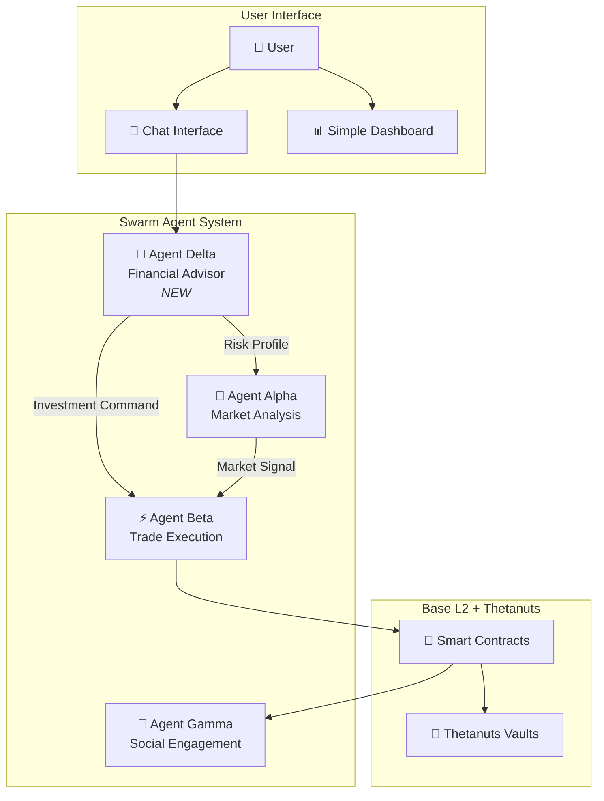
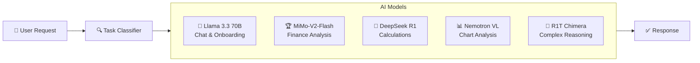
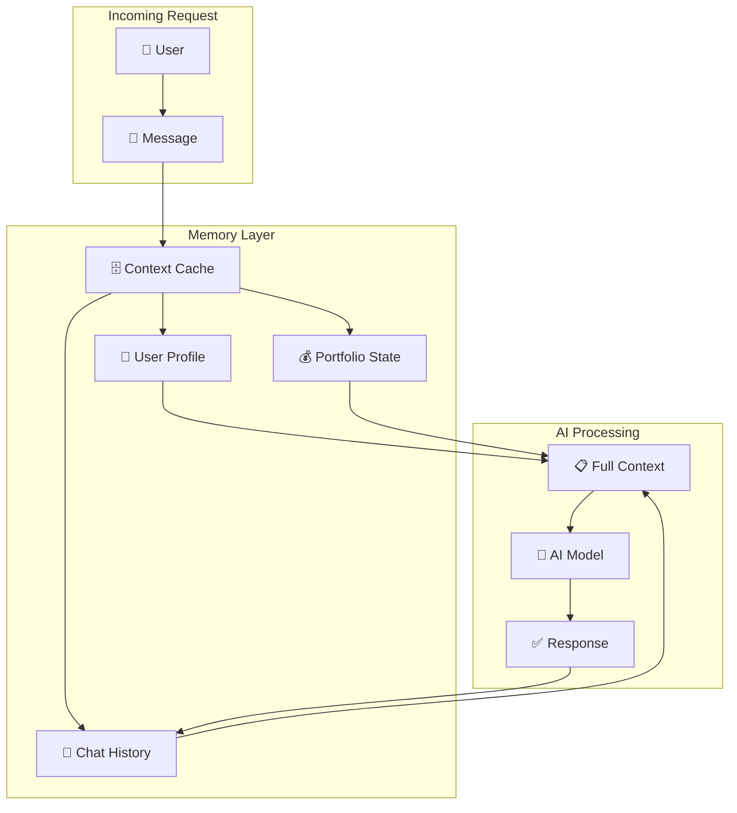
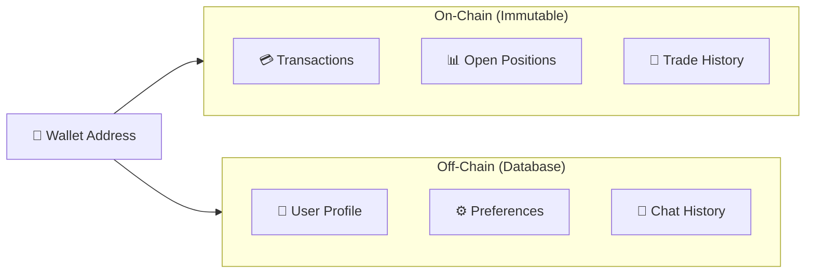
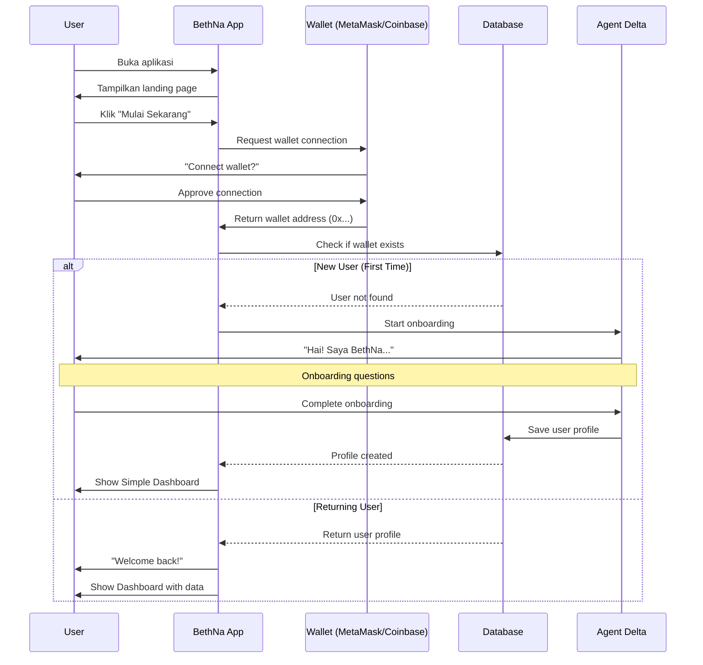

# BethNa AI - Financial Advisor Feature

> Dokumentasi fitur Financial Advisor untuk platform BethNa AI - membuat DeFi accessible untuk semua orang.

---

## 🎯 Visi

BethNa AI bukan hanya untuk trader profesional. Platform ini dirancang agar **orang awam dengan gaji UMR** dapat mengelola keuangan crypto mereka dengan mudah, aman, dan cerdas.

---

## 🎨 UI Design Reference

### Design Sources

| Page | Reference Style | Key Elements |
|------|-----------------|--------------|
| `/onboarding` | Careora (Health Onboarding) | Welcome screen, step cards, progress sidebar |
| `/dashboard/chat` | Orbita GPT (AI Chat) | Chat bubbles, history sidebar, quick actions |

### Page Structure

```
FIRST VISIT: /onboarding
┌──────────────────┬─────────────────────────────────────────────────────┐
│  Progress        │              Welcome Screen                        │
│  Sidebar         │                                                     │
│                  │  "Welcome to BethNa AI, [Name]! 👋"                │
│  ● Income        │                                                     │
│  ○ Expenses      │  ┌─────────┐ ┌─────────┐ ┌─────────┐ ┌─────────┐  │
│  ○ Savings       │  │ #1      │ │ #2      │ │ #3      │ │ #4      │  │
│  ○ Risk          │  │ Income  │ │ Expense │ │ Risk    │ │ Goal    │  │
│  ○ Goal          │  └─────────┘ └─────────┘ └─────────┘ └─────────┘  │
│                  │                                                     │
│                  │            [Get Started Button]                     │
└──────────────────┴─────────────────────────────────────────────────────┘

AFTER ONBOARDING: /dashboard/chat
┌──────────┬──────────────┬──────────────────────────────────────────────┐
│  Main    │  Chat        │              AI Chat Interface               │
│  Sidebar │  History     │                                              │
│ (exist)  │  Sidebar     │          "Hi, there 👋"                      │
│          │              │          Tell us what you need               │
│  🏠 Home │  Today       │                                              │
│  📊 Port │  ├─ Chat 1   │  ┌──────────────────────────────────────┐   │
│  💬 Chat │  └─ Chat 2   │  │ 🤖 BethNa   Financial Advisor       │   │
│  ⚙️ Set  │              │  │ Your personal AI for DeFi investing │   │
│          │  Yesterday   │  └──────────────────────────────────────┘   │
│          │  └─ Chat 3   │                                              │
│          │              │  [Quick Actions: Deposit, Check, Ask]       │
│          │              │                                              │
│          │              │  ┌──────────────────────────────────────┐   │
│          │              │  │ Ask me anything...            [Send] │   │
│          │              │  └──────────────────────────────────────┘   │
└──────────┴──────────────┴──────────────────────────────────────────────┘
```

### Color Scheme

Tetap menggunakan BethNa existing theme:

| Element | Color | Usage |
|---------|-------|-------|
| **Primary** | Lime Green (#C1FF72) | Buttons, accents, highlights |
| **Background** | Dark (#0A0A0B) | Main background |
| **Card** | Glass effect | Cards, sidebars |
| **Text** | White/Gray | Primary/secondary text |

### Component Specifications

#### Onboarding Progress Sidebar
```
Width: 280px (fixed)
Style: Glass effect with blur
Progress indicators: ● (completed), ◐ (current), ○ (upcoming)
```

#### Chat History Sidebar
```
Width: 260px (collapsible)
Sections: Today, Yesterday, Last 7 Days, Older
Chat items: Title + preview text + timestamp
```

#### Chat Input Area
```
Style: Glass card with border
Placeholder: "Ask me anything..."
Actions: Attach, Voice, Send button
```

---

## 🤖 Agent Architecture (Updated)



---

## 🆕 Agent Delta - Financial Advisor

### Deskripsi

Agent Delta adalah **AI Financial Advisor** yang bertugas:
1. **Onboarding** - Menanyakan profil keuangan user
2. **Recommendation** - Memberikan saran investasi yang sesuai
3. **Translation** - Menerjemahkan kompleksitas DeFi ke bahasa sederhana
4. **Monitoring** - Memberikan update berkala tentang portfolio

### Teknologi

| Component | Technology |
|-----------|------------|
| **NLP Engine** | OpenRouter AI (Multi-Model) |
| **Knowledge Base** | Thetanuts product info, DeFi basics |
| **Conversation Storage** | Local state / Database |
| **Risk Assessment** | Rule-based + AI scoring |
| **Memory System** | User Context Cache |

---

## 🧠 Multi-Model AI Strategy

### Konsep: Task-Based Model Routing

Kita menggunakan **5 model AI gratis** dari OpenRouter, masing-masing untuk task yang berbeda:



### Model Registry

| Model ID | Purpose | Strengths |
|----------|---------|-----------|
| `meta-llama/llama-3.3-70b-instruct:free` | **Chat & Onboarding** | Bahasa Indonesia natural, friendly tone |
| `xiaomi/mimo-v2-flash:free` | **Financial Analysis** | Ranked #1 Finance, 256K context |
| `deepseek/deepseek-r1-zero:free` | **Calculations** | Mathematical & quantitative reasoning |
| `nvidia/nemotron-nano-12b-2-vl:free` | **Visual Analysis** | Chart reading, financial reports |
| `tng/deepseek-r1t-chimera:free` | **Complex Decisions** | Long-context, multi-step reasoning |

### Task Classification

```typescript
type TaskType = 
  | 'CHAT'           // General conversation
  | 'ONBOARDING'     // Profile setup
  | 'RISK_ANALYSIS'  // Risk assessment
  | 'CALCULATION'    // Number crunching
  | 'CHART_ANALYSIS' // Visual data
  | 'RECOMMENDATION' // Investment advice
  | 'COMPLEX_QUERY'  // Multi-step reasoning

function classifyTask(message: string): TaskType {
  // Keyword-based classification
  if (message.includes('berapa') || message.includes('hitung')) {
    return 'CALCULATION';
  }
  if (message.includes('grafik') || message.includes('chart')) {
    return 'CHART_ANALYSIS';
  }
  if (message.includes('risiko') || message.includes('aman')) {
    return 'RISK_ANALYSIS';
  }
  if (message.includes('rekomendasi') || message.includes('saran')) {
    return 'RECOMMENDATION';
  }
  // ... more rules
  return 'CHAT';
}

function getModelForTask(task: TaskType): string {
  const modelMap: Record<TaskType, string> = {
    'CHAT': 'meta-llama/llama-3.3-70b-instruct:free',
    'ONBOARDING': 'meta-llama/llama-3.3-70b-instruct:free',
    'RISK_ANALYSIS': 'xiaomi/mimo-v2-flash:free',
    'CALCULATION': 'deepseek/deepseek-r1-zero:free',
    'CHART_ANALYSIS': 'nvidia/nemotron-nano-12b-2-vl:free',
    'RECOMMENDATION': 'xiaomi/mimo-v2-flash:free',
    'COMPLEX_QUERY': 'tng/deepseek-r1t-chimera:free',
  };
  return modelMap[task];
}
```

### Example Routing

| User Message | Classified As | Model Used |
|--------------|---------------|------------|
| "Hai, saya baru di sini" | ONBOARDING | Llama 3.3 70B |
| "Berapa expected return 500rb/bulan?" | CALCULATION | DeepSeek R1 |
| "Apa risiko invest di vault ini?" | RISK_ANALYSIS | MiMo-V2-Flash |
| "Lihat performa portfolio saya" | CHART_ANALYSIS | Nemotron VL |
| "Haruskah saya pindah ke aggressive?" | COMPLEX_QUERY | R1T Chimera |

---

## 💾 User Memory Cache System

### Problem: AI Amnesia

Tanpa memory system, AI akan:
- ❌ Lupa profil user setiap conversation
- ❌ Tanya pertanyaan yang sama berulang
- ❌ Memberikan saran yang tidak konsisten
- ❌ Tidak ingat history investasi user

### Solution: Persistent Context Cache



### Memory Schema

```typescript
interface UserMemory {
  // Wallet identity
  walletAddress: `0x${string}`;
  
  // Profile (from onboarding)
  profile: {
    monthlyIncome: number;
    investmentAmount: number;
    riskProfile: 'CONSERVATIVE' | 'BALANCED' | 'AGGRESSIVE';
    financialGoals: string[];
    investmentHorizon: 'SHORT' | 'MEDIUM' | 'LONG';
  };
  
  // Conversation history (last N messages)
  chatHistory: {
    role: 'user' | 'assistant';
    content: string;
    timestamp: Date;
    taskType: TaskType;
    modelUsed: string;
  }[];
  
  // Portfolio snapshot
  portfolio: {
    totalInvested: number;
    currentValue: number;
    positions: Position[];
    lastUpdated: Date;
  };
  
  // AI learning about user
  insights: {
    preferredLanguage: 'id' | 'en';
    communicationStyle: 'formal' | 'casual';
    knowledgeLevel: 'beginner' | 'intermediate' | 'advanced';
    frequentQuestions: string[];
  };
  
  // Session metadata
  metadata: {
    createdAt: Date;
    lastActiveAt: Date;
    totalSessions: number;
    totalMessages: number;
  };
}
```

### Context Building for AI

```typescript
function buildAIContext(memory: UserMemory, currentMessage: string): string {
  return `
## User Profile
- Wallet: ${memory.walletAddress.slice(0, 10)}...
- Risk Profile: ${memory.profile.riskProfile}
- Monthly Investment: Rp ${memory.profile.investmentAmount.toLocaleString()}
- Knowledge Level: ${memory.insights.knowledgeLevel}

## Current Portfolio
- Total Invested: Rp ${memory.portfolio.totalInvested.toLocaleString()}
- Current Value: Rp ${memory.portfolio.currentValue.toLocaleString()}
- PnL: ${((memory.portfolio.currentValue - memory.portfolio.totalInvested) / memory.portfolio.totalInvested * 100).toFixed(2)}%
- Active Positions: ${memory.portfolio.positions.length}

## Recent Conversation
${memory.chatHistory.slice(-5).map(m => 
  `${m.role === 'user' ? 'User' : 'BethNa'}: ${m.content}`
).join('\n')}

## Current Message
User: ${currentMessage}

## Instructions
Respond as BethNa AI Financial Advisor. Use the context above to give personalized advice.
Remember the user's risk profile (${memory.profile.riskProfile}) when giving recommendations.
Speak in ${memory.insights.preferredLanguage === 'id' ? 'Bahasa Indonesia' : 'English'}.
Adjust complexity based on user's knowledge level (${memory.insights.knowledgeLevel}).
  `.trim();
}
```

### Memory Persistence Options

| Storage Type | Pros | Cons | Best For |
|--------------|------|------|----------|
| **LocalStorage** | Fast, no server | Device-specific | MVP/Demo |
| **IndexedDB** | Large capacity, offline | Device-specific | Advanced MVP |
| **PostgreSQL** | Persistent, scalable | Needs server | Production |
| **Redis** | Ultra-fast cache | Memory-based | Session cache |

### Recommended Stack (Production)

```
┌─────────────────────────────────────────────┐
│  User Request                               │
├─────────────────────────────────────────────┤
│  ↓                                          │
│  Redis (Session Cache) ← Fast reads         │
│  ↓                                          │
│  PostgreSQL (Permanent Storage)             │
│  ↓                                          │
│  AI Context Builder                         │
│  ↓                                          │
│  Multi-Model Router                         │
│  ↓                                          │
│  Response + Update Memory                   │
└─────────────────────────────────────────────┘
```

### Memory Update Flow

```typescript
async function processMessage(
  walletAddress: string, 
  message: string
): Promise<string> {
  // 1. Load user memory from cache/DB
  const memory = await loadUserMemory(walletAddress);
  
  // 2. Classify task and select model
  const taskType = classifyTask(message);
  const model = getModelForTask(taskType);
  
  // 3. Build full context with memory
  const context = buildAIContext(memory, message);
  
  // 4. Get AI response
  const response = await callOpenRouter(model, context);
  
  // 5. Update memory with new message
  memory.chatHistory.push(
    { role: 'user', content: message, timestamp: new Date(), taskType, modelUsed: model },
    { role: 'assistant', content: response, timestamp: new Date(), taskType, modelUsed: model }
  );
  
  // 6. Update insights based on interaction
  memory.insights = updateInsights(memory.insights, message, response);
  
  // 7. Save updated memory
  await saveUserMemory(walletAddress, memory);
  
  // 8. Return response
  return response;
}
```

### Accuracy Safeguards

| Issue | Solution |
|-------|----------|
| **Conflicting advice** | Always reference user's risk profile in context |
| **Forgotten preferences** | Load full profile before every response |
| **Inconsistent tone** | Include communication style in system prompt |
| **Outdated portfolio data** | Fetch latest on-chain data before responding |
| **Context window overflow** | Keep only last 10-20 messages, summarize older ones |

## � User Identification & Registration

### Bagaimana User Diidentifikasi?

User diidentifikasi menggunakan **Wallet Address** sebagai unique identifier:

```
Wallet Address (0x...) = User ID
```

### Kenapa Wallet Address?

| Keuntungan | Penjelasan |
|------------|------------|
| ✅ **Unique** | Setiap wallet address pasti unik |
| ✅ **No Password** | User tidak perlu ingat password |
| ✅ **Decentralized** | Tidak ada central database yang bisa di-hack |
| ✅ **Portable** | User bisa akses dari device manapun |
| ✅ **Web3 Native** | Cocok dengan ekosistem blockchain |

### Data Storage Strategy



| Data Type | Storage | Reason |
|-----------|---------|--------|
| **Wallet Address** | Primary Key | Unique identifier |
| **Risk Profile** | Off-chain DB | Can be updated |
| **Monthly Income** | Off-chain DB | Private info |
| **Investment Amount** | Off-chain DB | Preferences |
| **Chat History** | Off-chain DB | UX continuity |
| **Positions** | On-chain | Transparency |
| **Transactions** | On-chain | Immutable record |

---

## 📝 Registration Flow (New User)

### Step-by-Step Flow



### Registration UI Flow

```
┌─────────────────────────────────────────────────┐
│                                                 │
│           🤖 BethNa AI                         │
│     AI-Powered Financial Management            │
│                                                 │
│     Kelola keuangan crypto kamu dengan         │
│     mudah, aman, dan cerdas.                   │
│                                                 │
│        ┌─────────────────────────┐             │
│        │   🔗 Connect Wallet     │             │
│        └─────────────────────────┘             │
│                                                 │
│     Supported: MetaMask, Coinbase, Rainbow     │
│                                                 │
└─────────────────────────────────────────────────┘
                        ↓
                  [User clicks]
                        ↓
┌─────────────────────────────────────────────────┐
│  🔐 Connect Your Wallet                         │
│                                                 │
│  ┌──────────┐ ┌──────────┐ ┌──────────┐        │
│  │ MetaMask │ │ Coinbase │ │ Rainbow  │        │
│  │   🦊     │ │    💙    │ │    🌈    │        │
│  └──────────┘ └──────────┘ └──────────┘        │
│                                                 │
│  ⚠️ Pastikan kamu di Base Network              │
│                                                 │
└─────────────────────────────────────────────────┘
                        ↓
              [Wallet connected]
                        ↓
┌─────────────────────────────────────────────────┐
│  ✅ Wallet Connected!                           │
│                                                 │
│  Address: 0x1234...abcd                        │
│  Network: Base Mainnet                          │
│                                                 │
│  Ini pertama kali kamu di sini!                │
│  Mari setup profil investasi kamu.             │
│                                                 │
│        ┌─────────────────────────┐             │
│        │   🚀 Mulai Setup        │             │
│        └─────────────────────────┘             │
│                                                 │
└─────────────────────────────────────────────────┘
                        ↓
              [User clicks Mulai Setup]
                        ↓
         🆕 REDIRECT KE AI CHAT PAGE 🆕
```

---

## 💬 AI Onboarding Chat Page

### Konsep

Sebelum user masuk ke Dashboard, mereka **HARUS** melewati halaman **AI Chat** untuk breakdown keuangan mereka. Ini adalah halaman khusus (`/onboarding`) yang berbeda dari Dashboard.

### Page Flow

```
/                    → Landing Page
/onboarding          → AI Chat Page (WAJIB untuk new user)
/dashboard           → Main Dashboard (setelah onboarding selesai)
```

### Route Protection Logic

```typescript
// middleware.ts atau page component
async function checkUserAccess(walletAddress: string) {
  const user = await getUserProfile(walletAddress);
  
  if (!user) {
    // New user - redirect ke onboarding
    return redirect('/onboarding');
  }
  
  if (!user.onboardingCompleted) {
    // Onboarding belum selesai - redirect ke onboarding
    return redirect('/onboarding');
  }
  
  // User sudah complete - allow access ke dashboard
  return true;
}
```

### AI Chat Page UI (`/onboarding`)

```
┌─────────────────────────────────────────────────────────────────────┐
│  BethNa AI                                    0x1234...abcd  [⚙️]  │
├─────────────────────────────────────────────────────────────────────┤
│                                                                     │
│  ┌─────────────────────────────────────────────────────────────┐   │
│  │                                                             │   │
│  │                      🤖 BethNa AI                          │   │
│  │              Your Personal Financial Advisor                │   │
│  │                                                             │   │
│  │  ┌─────────────────────────────────────────────────────┐   │   │
│  │  │  🤖 Hai! Saya BethNa, asisten keuangan AI kamu.    │   │   │
│  │  │                                                     │   │   │
│  │  │  Sebelum kita mulai, saya ingin mengenal situasi   │   │   │
│  │  │  keuangan kamu agar bisa memberikan saran yang     │   │   │
│  │  │  tepat.                                            │   │   │
│  │  │                                                     │   │   │
│  │  │  Boleh saya tanya beberapa hal?                    │   │   │
│  │  └─────────────────────────────────────────────────────┘   │   │
│  │                                                             │   │
│  │  ┌─────────────────────────────────────────────────────┐   │   │
│  │  │  👤 Ya, boleh!                                      │   │   │
│  │  └─────────────────────────────────────────────────────┘   │   │
│  │                                                             │   │
│  │  ┌─────────────────────────────────────────────────────┐   │   │
│  │  │  🤖 Bagus! Pertama, berapa penghasilan bulanan     │   │   │
│  │  │  kamu saat ini?                                    │   │   │
│  │  │                                                     │   │   │
│  │  │  [< 5 juta] [5-10 juta] [10-20 juta] [> 20 juta]   │   │   │
│  │  └─────────────────────────────────────────────────────┘   │   │
│  │                                                             │   │
│  └─────────────────────────────────────────────────────────────┘   │
│                                                                     │
│  ┌─────────────────────────────────────────────────────────────┐   │
│  │  Ketik pesan...                                    [Send]  │   │
│  └─────────────────────────────────────────────────────────────┘   │
│                                                                     │
│  Progress: ████████░░░░░░░░░░░░ 40% (3/7 questions)               │
│                                                                     │
└─────────────────────────────────────────────────────────────────────┘
```

### Onboarding Chat Flow (Complete)

```
🤖 BethNa: "Hai! Saya BethNa, asisten keuangan AI kamu.
           Sebelum kita mulai, saya ingin mengenal situasi keuangan 
           kamu agar bisa memberikan saran yang tepat.
           
           Boleh saya tanya beberapa hal?"

👤 User: "Ya, boleh!"

───────────────────────────────────────────────────────
STEP 1: INCOME (Penghasilan)
───────────────────────────────────────────────────────

🤖 BethNa: "Bagus! Pertama, berapa penghasilan bulanan kamu saat ini?"

   [< 5 juta] [5-10 juta] [10-20 juta] [> 20 juta]

👤 User: [5-10 juta]

🤖 BethNa: "Oke, penghasilan Rp 5-10 juta per bulan. 
           Ini sudah cukup bagus untuk mulai berinvestasi! 💪"

───────────────────────────────────────────────────────
STEP 2: EXPENSES (Pengeluaran)
───────────────────────────────────────────────────────

🤖 BethNa: "Sekarang tentang pengeluaran bulanan kamu.
           Kira-kira berapa persen dari gaji yang biasa kamu habiskan?"

   [< 50%] [50-70%] [70-90%] [> 90%]

👤 User: [50-70%]

🤖 BethNa: "Jadi kamu punya sekitar 30-50% sisa setiap bulan. 
           Itu bagus! Berarti ada ruang untuk menabung dan invest."

───────────────────────────────────────────────────────
STEP 3: SAVINGS (Tabungan)
───────────────────────────────────────────────────────

🤖 BethNa: "Apakah kamu sudah punya dana darurat? 
           (Idealnya 3-6x pengeluaran bulanan)"

   [Belum ada] [< 3 bulan] [3-6 bulan] [> 6 bulan]

👤 User: [< 3 bulan]

🤖 BethNa: "Oke, dana darurat kamu masih kurang dari 3 bulan.
           
           💡 Tips: Idealnya, bangun dulu dana darurat sebelum invest 
           agresif. Tapi kita masih bisa mulai dengan jumlah kecil!"

───────────────────────────────────────────────────────
STEP 4: INVESTMENT EXPERIENCE (Pengalaman Investasi)
───────────────────────────────────────────────────────

🤖 BethNa: "Seberapa familiar kamu dengan investasi dan crypto?"

   [🌱 Pemula - baru mulai]
   [📈 Menengah - pernah invest saham/reksadana]
   [🚀 Mahir - sudah trading crypto]

👤 User: [🌱 Pemula]

🤖 BethNa: "Tidak masalah! Semua orang mulai dari nol.
           Saya akan bantu jelaskan semuanya dengan bahasa sederhana. 😊"

───────────────────────────────────────────────────────
STEP 5: RISK TOLERANCE (Toleransi Risiko)
───────────────────────────────────────────────────────

🤖 BethNa: "Pertanyaan penting: Bagaimana perasaan kamu kalau nilai 
           investasi turun 20% dalam sebulan?"

   [😰 Panik, mau jual semua]
   [😐 Khawatir tapi bisa tahan]
   [😎 Santai, ini kesempatan beli lagi]

👤 User: [😐 Khawatir tapi bisa tahan]

🤖 BethNa: "Good! Kamu punya mentalitas yang cukup stabil.
           Ini penting untuk investasi jangka panjang."

───────────────────────────────────────────────────────
STEP 6: INVESTMENT AMOUNT (Jumlah Investasi)
───────────────────────────────────────────────────────

🤖 BethNa: "Based on semua yang kamu ceritakan, saya sarankan untuk 
           invest 10-20% dari gaji kamu.
           
           Dengan gaji Rp 5-10 juta, berarti sekitar:
           💰 Rp 500.000 - Rp 2.000.000/bulan
           
           Berapa yang nyaman untuk kamu?"

   [Rp 500rb] [Rp 1 juta] [Rp 1.5 juta] [Custom]

👤 User: [Rp 500rb]

🤖 BethNa: "Perfect! Rp 500.000/bulan adalah awal yang bagus.
           Ingat: Konsistensi lebih penting dari jumlah besar!"

───────────────────────────────────────────────────────
STEP 7: FINANCIAL GOAL (Tujuan Keuangan)
───────────────────────────────────────────────────────

🤖 BethNa: "Terakhir, apa tujuan keuangan utama kamu?"

   [🏠 Beli rumah/properti]
   [🎓 Dana pendidikan]
   [🏖️ Dana pensiun]
   [💰 Passive income]
   [📈 Grow wealth]

👤 User: [💰 Passive income]

───────────────────────────────────────────────────────
SUMMARY & PROFILE CREATION
───────────────────────────────────────────────────────

🤖 BethNa: "Terima kasih sudah menjawab! 🎉

           Berdasarkan semua jawaban kamu, ini profil keuangan kamu:
           
           ┌─────────────────────────────────────────┐
           │  📊 PROFIL KEUANGAN KAMU                │
           ├─────────────────────────────────────────┤
           │  💵 Penghasilan: Rp 5-10 juta/bulan    │
           │  💰 Sisa bulanan: ~30-50%              │
           │  🛡️ Dana darurat: < 3 bulan            │
           │  📈 Experience: Pemula                  │
           │  🎯 Risk Profile: BALANCED             │
           │  💸 Investment: Rp 500.000/bulan       │
           │  🏆 Goal: Passive Income               │
           └─────────────────────────────────────────┘
           
           Dengan profil ini, saya rekomendasikan:
           
           ✅ Strategy: BALANCED (mix conservative + growth)
           ✅ Vault: Thetanuts Mixed Vault
           ✅ Expected Yield: 10-15%/tahun
           
           Siap untuk mulai? 🚀"

   [✅ Ya, mulai sekarang!] [🔄 Ubah jawaban]

👤 User: [✅ Ya, mulai sekarang!]

🤖 BethNa: "Selamat! Profil kamu sudah tersimpan.
           
           Kamu akan diarahkan ke Dashboard dalam 3 detik...
           
           Di Dashboard, kamu bisa:
           • Lihat portfolio kamu
           • Tambah dana investasi
           • Chat dengan saya kapan saja
           
           Let's grow your wealth together! 💪"

           [Redirecting to Dashboard... 3... 2... 1...]
```

### Page Component Structure

```typescript
// src/app/onboarding/page.tsx

interface OnboardingState {
  step: number;
  totalSteps: number;
  answers: {
    income?: string;
    expenses?: string;
    savings?: string;
    experience?: string;
    riskTolerance?: string;
    investmentAmount?: number;
    financialGoal?: string;
  };
  chatHistory: ChatMessage[];
  isComplete: boolean;
}

export default function OnboardingPage() {
  const { address } = useAccount();
  const [state, setState] = useState<OnboardingState>(initialState);
  
  // Redirect if already onboarded
  useEffect(() => {
    if (user?.onboardingCompleted) {
      router.push('/dashboard');
    }
  }, [user]);
  
  // Handle AI responses and progression
  async function handleUserResponse(response: string) {
    // Add user message to chat
    // Get AI response
    // Update step
    // If complete, save profile and redirect
  }
  
  return (
    <div className="onboarding-container">
      <Header walletAddress={address} />
      <ChatInterface 
        messages={state.chatHistory}
        onSendMessage={handleUserResponse}
        quickReplies={getQuickRepliesForStep(state.step)}
      />
      <ProgressBar current={state.step} total={state.totalSteps} />
    </div>
  );
}
```

### API untuk Onboarding

```
POST /api/onboarding/start
- Input: { walletAddress: string }
- Output: { sessionId: string, firstMessage: string }

POST /api/onboarding/respond
- Input: { sessionId: string, response: string }
- Output: { aiMessage: string, step: number, quickReplies?: string[] }

POST /api/onboarding/complete
- Input: { sessionId: string, walletAddress: string }
- Output: { profile: UserProfile, redirectUrl: string }
```

### User Profile Schema

```typescript
interface UserProfile {
  // Identity (from wallet)
  walletAddress: `0x${string}`;  // Primary key
  
  // Onboarding data
  monthlyIncome: number;         // e.g., 5000000 (IDR)
  investmentAmount: number;      // e.g., 500000 (IDR)
  investmentPercentage: number;  // e.g., 10 (%)
  riskProfile: 'CONSERVATIVE' | 'BALANCED' | 'AGGRESSIVE';
  
  // Preferences
  currency: 'IDR' | 'USD';
  language: 'id' | 'en';
  notificationsEnabled: boolean;
  dashboardMode: 'SIMPLE' | 'ADVANCED';
  
  // Metadata
  createdAt: Date;
  updatedAt: Date;
  lastLoginAt: Date;
  onboardingCompleted: boolean;
}
```

### Persona Detection Logic

```typescript
function detectPersona(profile: UserProfile): 'BEGINNER' | 'INTERMEDIATE' | 'ADVANCED' {
  // Check 1: Onboarding completion
  if (!profile.onboardingCompleted) {
    return 'BEGINNER';
  }
  
  // Check 2: Dashboard preference
  if (profile.dashboardMode === 'ADVANCED') {
    return 'ADVANCED';
  }
  
  // Check 3: Risk profile
  if (profile.riskProfile === 'AGGRESSIVE') {
    return 'ADVANCED';
  }
  
  // Check 4: Investment amount (proxy for experience)
  if (profile.investmentAmount > 5000000) { // > 5 juta
    return 'INTERMEDIATE';
  }
  
  return 'BEGINNER';
}
```

### API Endpoints for User Management

```
POST /api/user/connect
- Input: { walletAddress: string }
- Output: { isNewUser: boolean, profile?: UserProfile }
- Action: Check if user exists, return status

POST /api/user/register
- Input: { walletAddress: string, onboardingData: OnboardingAnswers }
- Output: { success: boolean, profile: UserProfile }
- Action: Create new user profile

PUT /api/user/profile
- Input: { walletAddress: string, updates: Partial<UserProfile> }
- Output: { success: boolean, profile: UserProfile }
- Action: Update user preferences

GET /api/user/profile/:walletAddress
- Output: { profile: UserProfile, positions: Position[], stats: Stats }
- Action: Fetch complete user data
```

---

## �💬 Conversation Flow

### Onboarding Questions

```
Agent Delta: "Hai! 👋 Saya BethNa, asisten keuangan AI kamu. 
             Boleh saya tanya beberapa hal untuk membantu kamu?"

User: "Ya, boleh"

Agent Delta: "Berapa penghasilan bulanan kamu?"
[Input field atau pilihan range]

User: "5 juta"

Agent Delta: "Dari Rp 5 juta, berapa yang bisa kamu sisihkan untuk 
             investasi setiap bulan? Ingat, investasi punya risiko."
[10%] [20%] [30%] [Custom]

User: [10%] → Rp 500.000

Agent Delta: "Bagus! Rp 500.000/bulan. Sekarang tentang risiko...
             
             Pilih yang paling cocok dengan kamu:
             
             🐢 AMAN - Pertumbuhan stabil, risiko rendah (5-10%/tahun)
             ⚖️ SEIMBANG - Balance antara growth dan risiko (10-20%/tahun)
             🚀 AGRESIF - Potensi tinggi, risiko tinggi (20%+/tahun)"

User: [🐢 AMAN]

Agent Delta: "Perfect! Berdasarkan profil kamu:
             
             📊 Investment: Rp 500.000/bulan
             🎯 Risk Profile: Conservative
             💰 Expected Yield: 8-12%/tahun
             
             Saya akan otomatis menginvestasikan dana kamu ke 
             Thetanuts Conservative Vault yang sudah diaudit.
             
             [Mulai Investasi] [Tanya Lebih Lanjut]"
```

### Pertanyaan Lanjutan (FAQ Mode)

```
User: "Apa itu Thetanuts?"

Agent Delta: "Thetanuts adalah protokol DeFi yang aman untuk earn yield.
             
             Bayangkan seperti deposito bank, tapi:
             ✅ Yield lebih tinggi (8-25%/tahun vs 3-5% bank)
             ✅ Transparan (bisa dilihat di blockchain)
             ✅ Kamu pegang sendiri uangnya (non-custodial)
             
             Yang saya rekomendasikan adalah vault CONSERVATIVE 
             yang risikonya paling rendah."

User: "Kalau rugi bagaimana?"

Agent Delta: "Pertanyaan bagus! 💡
             
             Risiko yang ada:
             ⚠️ Nilai crypto bisa turun (market risk)
             ⚠️ Smart contract bisa punya bug (sudah diaudit)
             
             Yang saya lakukan untuk minimize risiko:
             ✅ Pilih vault yang sudah diaudit
             ✅ Monitor market 24/7
             ✅ Alert kalau ada kondisi bahaya
             
             Ingat: Jangan investasi uang yang kamu butuhkan 
             dalam waktu dekat!"
```

---

## 📊 Risk Profiles

| Profile | Expected Yield | Thetanuts Strategy | Risk Level |
|---------|----------------|-------------------|------------|
| 🐢 **Conservative** | 8-12%/year | Basic Vault, Covered Calls | Low |
| ⚖️ **Balanced** | 12-20%/year | Mixed Vaults, Some Options | Medium |
| 🚀 **Aggressive** | 20%+/year | Options Trading, High Yield Vaults | High |

---

## 🖥️ Simplified Dashboard

### For Beginners (Default View)

```
┌─────────────────────────────────────────────────┐
│  BethNa AI - Portfolio Kamu                     │
├─────────────────────────────────────────────────┤
│                                                 │
│  💰 Total Investasi: Rp 1.500.000              │
│  📈 Nilai Sekarang:  Rp 1.567.500              │
│  ✨ Profit:          +Rp 67.500 (+4.5%)        │
│                                                 │
│  ┌─────────────────────────────────────────┐   │
│  │ [=============================    ] 75% │   │
│  │      Menuju target Rp 2.000.000        │   │
│  └─────────────────────────────────────────┘   │
│                                                 │
│  🤖 AI Status: Aktif memantau market           │
│  📅 Last Action: Deposit ke Vault (2 jam lalu) │
│                                                 │
│  [+ Tambah Dana]  [💬 Tanya AI]  [Tarik Dana]  │
│                                                 │
└─────────────────────────────────────────────────┘
```

### For Advanced Users (Toggle View)

```
┌─────────────────────────────────────────────────┐
│  BethNa AI - Trading Terminal           [👤 ⚙️]│
├─────────────────────────────────────────────────┤
│  POSITIONS                                      │
│  ├─ ETH-USDC Call Option | +12.5% | 0.5 ETH    │
│  ├─ BTC Covered Call     | +8.2%  | 0.02 BTC   │
│  └─ USDC Vault           | +5.1%  | $500       │
│                                                 │
│  SIGNALS (Agent Alpha)                         │
│  📊 RSI: 45.2 | BB: MIDDLE | Signal: HOLD      │
│                                                 │
│  WAR ROOM LOG                                  │
│  > Alpha: Market stable, no action needed      │
│  > Beta: Monitoring positions for TP/SL        │
│  > Gamma: Posted daily update to Farcaster     │
│                                                 │
│  [Execute Trade] [Close Position] [Settings]   │
└─────────────────────────────────────────────────┘
```

---

## 🔄 Integration dengan Agents Lain

### Flow: User Invest Rp 500.000

```
1. User klik [+ Tambah Dana]
   ↓
2. Agent Delta: "Mau tambah Rp 500.000 ke Conservative Vault?"
   ↓
3. User confirm → Delta kirim command ke Beta
   ↓
4. Agent Alpha: Check market condition (safe to invest?)
   ↓
5. Agent Beta: Execute deposit ke Thetanuts via Smart Contract
   ↓
6. Smart Contract: Emit event "DepositExecuted"
   ↓
7. Agent Gamma: Post update ke Farcaster
   "🎉 New deposit! User #1234 invested $30 USD into BethNa AI"
   ↓
8. Agent Delta: Notify user
   "✅ Investasi berhasil! Dana kamu sekarang bekerja di Thetanuts."
```

---

## 📱 User Personas

### Persona 1: Andi (Pemula)
- **Gaji**: Rp 5.000.000
- **Investasi**: Rp 500.000/bulan
- **Profile**: Conservative
- **Interaksi**: Chat dengan Agent Delta
- **View**: Simple Dashboard only

### Persona 2: Budi (Intermediate)
- **Gaji**: Rp 15.000.000
- **Investasi**: Rp 3.000.000/bulan
- **Profile**: Balanced
- **Interaksi**: Mix chat + manual
- **View**: Both Simple & Advanced

### Persona 3: Citra (Advanced)
- **Background**: Crypto trader
- **Investasi**: Variable
- **Profile**: Aggressive
- **Interaksi**: Direct trading
- **View**: Advanced Trading Terminal

---

## 🛠️ Technical Implementation

### New Components Needed

| Component | Type | Description |
|-----------|------|-------------|
| `agent-delta.ts` | Agent | Financial Advisor logic |
| `ChatInterface.tsx` | UI | Conversational UI component |
| `SimpleDashboard.tsx` | UI | Beginner-friendly dashboard |
| `RiskProfiler.tsx` | UI | Onboarding questionnaire |
| `UserProfile.ts` | Type | User risk profile & preferences |
| `/api/advisor` | API | Agent Delta endpoints |

### Agent Delta API Endpoints

```
POST /api/advisor/onboarding
- Input: { answers: OnboardingAnswers }
- Output: { riskProfile, recommendation }

POST /api/advisor/chat
- Input: { message: string, context: ChatContext }
- Output: { response: string, action?: Command }

GET /api/advisor/recommendation
- Input: { userId, marketData }
- Output: { action, reasoning, confidence }
```

---

## 🎯 Hackathon Value Proposition

### Why This Wins

1. **Thetanuts Integration** ✅
   - All investments flow through Thetanuts
   - Demonstrates real protocol usage

2. **Base Network** ✅
   - Low gas fees = micro-investments possible
   - Fast transactions for good UX

3. **Innovation** 🚀
   - AI-powered financial inclusion
   - Making DeFi accessible to non-crypto users

4. **Real Impact** 💰
   - Helps regular people earn better yields
   - Educational + practical

---

## 📋 Development Checklist

- [ ] Agent Delta implementation
  - [ ] Onboarding conversation flow
  - [ ] Risk profiling logic
  - [ ] Recommendation engine
  - [ ] Chat interface
- [ ] Simple Dashboard
  - [ ] Portfolio overview
  - [ ] Progress tracker
  - [ ] Quick actions
- [ ] Integration
  - [ ] Delta → Alpha (market check)
  - [ ] Delta → Beta (execute)
  - [ ] Events → Delta (notifications)
- [ ] UI/UX
  - [ ] Chat bubble component
  - [ ] Onboarding wizard
  - [ ] Toggle between Simple/Advanced view

---

*Dokumentasi ini adalah bagian dari BethNa AI project untuk hackathon Thetanuts track.*
