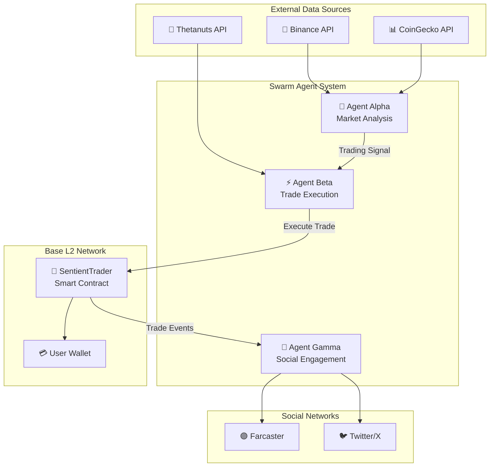
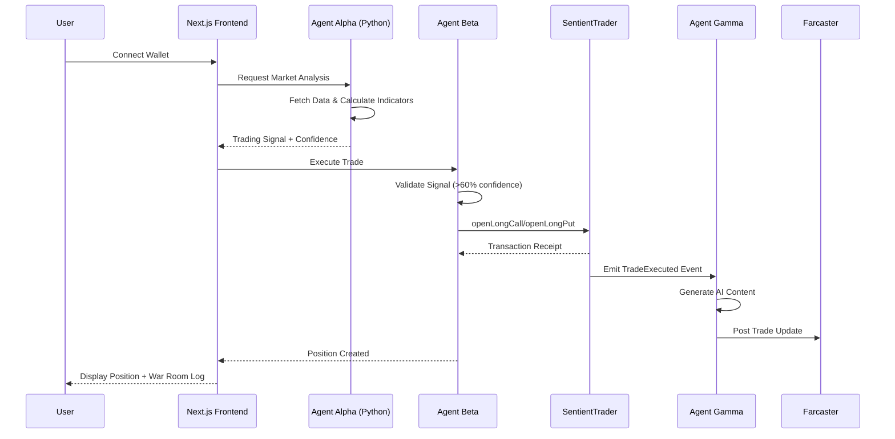

# BethNa AI Trader - Project Overview

> **Autonomous Swarm Agent System** untuk perdagangan cryptocurrency options berbasis AI pada Base L2 Network dengan integrasi Thetanuts Finance.

---

## 📋 Daftar Isi

1. [Ringkasan Proyek](#-ringkasan-proyek)
2. [Tech Stack](#-tech-stack)
3. [Arsitektur Swarm Agent](#-arsitektur-swarm-agent)
4. [Application Flow](#-application-flow)
5. [Fitur Utama](#-fitur-utama)
6. [Struktur Proyek](#-struktur-proyek)
7. [Smart Contracts](#-smart-contracts)
8. [API Endpoints](#-api-endpoints)
9. [Konfigurasi Environment](#-konfigurasi-environment)
10. [Design System](#-design-system)

---

## 🎯 Ringkasan Proyek

BethNa AI Trader adalah sistem trading cryptocurrency otomatis yang menggunakan pendekatan **Swarm Intelligence** dengan 4 agent khusus yang bekerja bersama untuk menganalisis pasar, mengeksekusi trades, dan melaporkan aktivitas secara transparan.

### Tujuan Utama

- **Autonomous Trading**: Sistem dapat beroperasi secara mandiri tanpa intervensi manusia
- **Multi-Agent Collaboration**: Agent-agent spesialisasi bekerja sama untuk keputusan trading optimal
- **Transparency**: Semua aktivitas dilaporkan melalui social media (Farcaster/Twitter)
- **On-chain Execution**: Trades dieksekusi langsung di Base L2 Network

---

## 🛠 Tech Stack

### Frontend

| Technology | Version | Purpose |
|------------|---------|---------|
| **Next.js** | 16.0.10 | React framework dengan App Router |
| **React** | 19.2.1 | UI library |
| **TypeScript** | 5.x | Static typing |
| **Tailwind CSS** | 4.x | Utility-first CSS framework |
| **Framer Motion** | 12.23.26 | Animasi dan transisi |
| **Lenis** | 1.3.16 | Smooth scrolling |
| **Lucide React** | 0.468.0 | Icon library |

### Blockchain & Web3

| Technology | Purpose |
|------------|---------|
| **viem** | Ethereum library untuk TypeScript |
| **wagmi** | React hooks untuk Ethereum |
| **OnchainKit** | Coinbase wallet integration |
| **RainbowKit** | Multi-wallet connector |
| **Farcaster SDK** | Decentralized social protocol |

### Backend (Agent Alpha)

| Technology | Version | Purpose |
|------------|---------|---------|
| **Python** | 3.9+ | Programming language |
| **FastAPI** | Latest | Async web framework |
| **uvicorn** | Latest | ASGI server |
| **Pydantic** | Latest | Data validation |
| **uv** | Latest | Package manager |

### Smart Contracts

| Technology | Purpose |
|------------|---------|
| **Solidity** | 0.8.25 | Smart contract language |
| **Foundry** | Testing & deployment framework |
| **OpenZeppelin** | Security standards & utilities |

### Testing

| Technology | Purpose |
|------------|---------|
| **Jest** | JavaScript testing framework |
| **fast-check** | Property-based testing |
| **pytest** | Python testing |
| **Hypothesis** | Python property-based testing |

---

## 🤖 Arsitektur Swarm Agent



### Agent Alpha - Quantitative Analysis 🧠

**Role**: Market data analysis dan signal generation

**Teknologi**: Python FastAPI Service

**Fungsi Utama**:
- Fetch historical price data dari CoinGecko/Binance
- Kalkulasi technical indicators (RSI, Bollinger Bands)
- Generate trading signals dengan confidence score
- Backtesting strategy untuk win rate calculation

**Trading Strategy**:
```
IF Price < Lower Bollinger Band AND RSI < 30 → BUY_CALL (oversold)
IF Price > Upper Bollinger Band AND RSI > 70 → BUY_PUT (overbought)
OTHERWISE → HOLD
```

---

### Agent Beta - Trade Execution Engine ⚡

**Role**: Interpretasi sinyal dan eksekusi trades

**Teknologi**: TypeScript + viem

**Fungsi Utama**:
- Menerima sinyal dari Agent Alpha
- Validasi confidence threshold (default: 60%)
- Execute trades via SentientTrader contract
- Position management (take profit/stop loss)
- Auto-close positions berdasarkan PnL

**Konfigurasi**:
| Parameter | Default | Description |
|-----------|---------|-------------|
| `confidenceThreshold` | 60% | Minimum confidence untuk execute trade |
| `takeProfitPercentage` | 10% | Auto-close at profit |
| `stopLossPercentage` | 5% | Auto-close at loss |
| `autoExecute` | false | Enable autonomous trading |

---

### Agent Gamma - Social Engagement Engine 📢

**Role**: Blockchain monitoring dan social posting

**Teknologi**: TypeScript + Farcaster SDK + OpenRouter AI

**Fungsi Utama**:
- Watch on-chain `TradeExecuted` events
- Generate AI-powered content via OpenRouter
- Post ke Farcaster menggunakan direct Hub connection
- Optional Twitter integration
- Rate limiting dengan cooldown period

**Content Styles**:
- `PROFESSIONAL`: Formal trading updates
- `CASUAL`: Friendly, emoji-rich posts
- `AGGRESSIVE`: Bold, confident messaging

---

## 🔄 Application Flow



### Flow Detail

1. **Market Analysis Cycle**
   - Agent Alpha fetches 30-day OHLC data
   - Calculates RSI (14 period) dan Bollinger Bands (20 period, 2 std)
   - Generates signal: `BUY_CALL`, `BUY_PUT`, `HOLD`, atau `CLOSE_POSITION`
   - Returns confidence (0-100%) berdasarkan backtest win rate

2. **Trade Execution Cycle**
   - Agent Beta menerima signal dari Alpha
   - Checks if `confidence >= confidenceThreshold`
   - Encodes function call untuk SentientTrader
   - Executes on-chain transaction via viem
   - Creates position entry dalam Position Manager

3. **Social Posting Cycle**
   - Agent Gamma watches contract events
   - Parses `TradeExecuted` event logs
   - Generates content template berdasarkan action
   - Optionally enhances with AI (OpenRouter)
   - Posts to Farcaster via direct Hub connection

---

## ✨ Fitur Utama

### ✅ Completed Features

| Feature | Description |
|---------|-------------|
| **Modern Web3 Dashboard** | Glassmorphism design dengan bento grid layout |
| **Real-time Trading Terminal** | Live market data dan AI signals |
| **Agent Alpha Integration** | Full Python FastAPI service |
| **Wallet Connection** | OnchainKit + RainbowKit support |
| **War Room Log** | Real-time agent communication display |
| **Landing Page** | Hero section dengan parallax scroll |
| **AI Agents Showcase** | Interactive agent cards dengan live stats |
| **Theme System** | Dark/Light mode dengan smooth transitions |

### 🔄 In Progress

| Feature | Status |
|---------|--------|
| Agent Beta Enhancement | Thetanuts V4 integration |
| Agent Gamma Social Posting | Direct Hub connection implemented |
| Position Tracking | Frontend UI in development |

---

## 📁 Struktur Proyek

```
bethna-ai-trader/
├── 📂 agent-alpha/              # Python FastAPI Backend
│   ├── main.py                  # FastAPI application entry
│   ├── services/
│   │   ├── coingecko.py        # CoinGecko API client
│   │   ├── indicators.py       # Technical indicator calculations
│   │   └── signals.py          # Signal generation logic
│   └── tests/                   # Python tests (pytest + hypothesis)
│
├── 📂 contracts/                # Solidity Smart Contracts
│   ├── SentientTrader.sol      # Main trading contract
│   ├── interfaces/
│   │   └── IThetanutsRouter.sol
│   ├── mocks/                   # Test mocks
│   └── test/                    # Foundry tests
│
├── 📂 src/                      # Next.js Frontend
│   ├── agents/                  # TypeScript agent implementations
│   │   ├── agent-alpha.ts      # Alpha API client
│   │   ├── agent-beta.ts       # Trade execution engine
│   │   └── agent-gamma.ts      # Social engagement engine
│   │
│   ├── app/                     # Next.js App Router
│   │   ├── api/                # API routes
│   │   │   ├── analyze/        # Market analysis endpoint
│   │   │   ├── farcaster-hub/  # Farcaster posting
│   │   │   ├── thetanuts/      # Options data
│   │   │   └── twitter/        # Twitter posting
│   │   ├── dashboard/          # Trading dashboard pages
│   │   └── page.tsx            # Landing page
│   │
│   ├── components/
│   │   ├── dashboard/          # Dashboard components
│   │   ├── landing/            # Landing page sections
│   │   ├── trading/            # Trading terminal
│   │   └── ui/                 # Shadcn/UI components
│   │
│   ├── hooks/                   # React custom hooks
│   ├── lib/                     # Utilities & API clients
│   │   ├── agents/             # Agent helper modules
│   │   ├── blockchain.ts       # viem client setup
│   │   ├── coingecko.ts        # Price fetching
│   │   ├── farcaster-hub.ts    # Farcaster Hub client
│   │   ├── openrouter.ts       # AI content generation
│   │   └── thetanuts-api.ts    # Thetanuts integration
│   │
│   ├── providers/               # React context providers
│   ├── services/                # Business logic services
│   ├── types/                   # TypeScript interfaces
│   └── utils/                   # Helper functions
│
├── 📂 docs/                     # Documentation
│   ├── Overview.md             # This document
│   ├── DEPLOYMENT.md           # Deployment guide
│   ├── GIT_WORKFLOW.md         # Git workflow
│   └── REAL_TIME_FEATURES.md   # WebSocket features
│
├── 📂 public/                   # Static assets
├── 📂 scripts/                  # Utility scripts
└── 📄 Configuration Files
    ├── package.json
    ├── foundry.toml             # Foundry config
    ├── tsconfig.json
    └── tailwind.config.js
```

---

## 📜 Smart Contracts

### SentientTrader.sol

**Purpose**: Autonomous options trading contract untuk Thetanuts Finance V4

**Network**: Base L2 (Mainnet: 8453, Testnet: 84532)

**Key Functions**:

```solidity
// Open long call position (bullish bet)
function openLongCall(uint256 amount, address optionToken) 
    external returns (uint256 amountOut);

// Open long put position (bearish bet)
function openLongPut(uint256 amount, address optionToken) 
    external returns (uint256 amountOut);

// Close position and receive USDC
function closePosition(address optionToken, uint256 amount) 
    external returns (uint256 amountOut);
```

**Security Features**:

| Feature | Description |
|---------|-------------|
| `ReentrancyGuard` | Prevents reentrancy attacks |
| `Ownable` | Access control untuk admin functions |
| `Pausable` | Emergency pause capability |
| `Slippage Protection` | `minAmountOut` parameter |
| `Authorized Traders` | Whitelist untuk agent wallets |

**Events**:

```solidity
event TradeExecuted(
    address indexed trader,
    address indexed optionToken,
    uint256 amountIn,
    uint256 amountOut,
    string action  // "OPEN_LONG_CALL", "OPEN_LONG_PUT", "CLOSE_POSITION"
);
```

---

## 🔌 API Endpoints

### Agent Alpha (Python FastAPI - Port 8000)

| Method | Endpoint | Description |
|--------|----------|-------------|
| `GET` | `/health` | Service health check |
| `GET` | `/candles` | Historical OHLC data |
| `GET` | `/indicators` | Current RSI & Bollinger Bands |
| `GET` | `/analyze` | Full market analysis + signal |
| `GET` | `/signal` | Quick trading signal |

**Example Response - `/analyze`**:
```json
{
  "signal": "BUY_CALL",
  "confidence": 75.5,
  "win_rate": 68.2,
  "reasoning": "Price below lower Bollinger Band with RSI at 28 (oversold)",
  "indicators": {
    "rsi": 28.45,
    "bollinger_upper": 3890.50,
    "bollinger_middle": 3750.00,
    "bollinger_lower": 3609.50,
    "current_price": 3580.00,
    "price_position": "LOWER"
  },
  "timestamp": "2024-12-25T10:30:00Z"
}
```

### Next.js API Routes (Port 3000)

| Endpoint | Description |
|----------|-------------|
| `/api/analyze` | Proxy ke Agent Alpha |
| `/api/health` | Frontend health check |
| `/api/prices` | Real-time price data |
| `/api/thetanuts` | Options market data |
| `/api/farcaster-hub/post` | Post ke Farcaster |
| `/api/twitter` | Post ke Twitter |

---

## ⚙️ Konfigurasi Environment

### Required Variables

```bash
# Base L2 Network
NEXT_PUBLIC_BASE_CHAIN_ID=8453
NEXT_PUBLIC_BASE_RPC_URL=https://mainnet.base.org
NEXT_PUBLIC_BASE_TESTNET_CHAIN_ID=84532
NEXT_PUBLIC_BASE_TESTNET_RPC_URL=https://sepolia.base.org

# Smart Contracts
NEXT_PUBLIC_SENTIENT_TRADER_CONTRACT=0x...
NEXT_PUBLIC_THETANUTS_ROUTER_CONTRACT=0x...

# Agent Alpha
NEXT_PUBLIC_AGENT_ALPHA_URL=http://localhost:8000
```

### Optional Variables

```bash
# Market Data APIs
COIN_GECKO_API_KEY=your_key
THETANUTS_API_KEY=your_key

# AI Content Generation (uses free model)
OPENROUTER_API_KEY=your_key
OPENROUTER_MODEL=kwaipilot/kat-coder-pro:free

# Social Media
TWITTER_API_KEY=your_key
TWITTER_API_SECRET=your_secret
TWITTER_ACCESS_TOKEN=your_token
TWITTER_ACCESS_TOKEN_SECRET=your_token_secret

# Farcaster (Direct Hub)
FARCASTER_FID=your_fid
FARCASTER_PRIVATE_KEY=0x...

# Wallet Integration
NEXT_PUBLIC_ONCHAINKIT_API_KEY=your_key
NEXT_PUBLIC_WALLET_CONNECT_PROJECT_ID=your_id
```

---

## 🎨 Design System

### Glassmorphism Components

- **Glass Cards**: Backdrop blur dengan subtle transparency
- **Floating Navigation**: Auto-hiding dengan smooth animations
- **Bento Grid**: Responsive layout dengan dynamic sizing

### Animation Libraries

| Library | Usage |
|---------|-------|
| **Framer Motion** | Component animations, stagger effects |
| **Lenis** | Smooth scroll behavior |
| **react-spring** | Physics-based animations |

### Color Palette

```css
/* Primary Colors */
--primary: #C1FF72;        /* Lime Green (Accent) */
--background: #0A0A0B;     /* Dark Background */
--foreground: #FFFFFF;     /* Text Color */

/* Glass Effect */
--glass-bg: rgba(255, 255, 255, 0.05);
--glass-border: rgba(255, 255, 255, 0.1);
```

### UI Components (Shadcn/UI Enhanced)

- **Button**: Variants - default, glass, outline, glow
- **Card**: Glass effect dengan hover animations
- **Progress**: Gradient fills dengan animation
- **Toast**: Notification system dengan multiple variants
- **Dialog**: Modal dengan backdrop blur

---

## 🚀 Quick Start

```bash
# 1. Clone & Install
git clone https://github.com/lana-techn/base-hackathon.git
cd base-hackathon/bethna-ai-trader
pnpm install

# 2. Setup Agent Alpha
cd agent-alpha
uv sync  # atau: pip install -r requirements.txt

# 3. Configure Environment
cp .env.example .env.local
# Edit .env.local dengan API keys

# 4. Run Services
# Terminal 1: Agent Alpha
cd agent-alpha
uv run uvicorn main:app --reload --port 8000

# Terminal 2: Frontend
pnpm dev:fast

# 5. Access Application
# - Landing: http://localhost:3000
# - Dashboard: http://localhost:3000/dashboard
# - API Docs: http://localhost:8000/docs
```

---

## ⚠️ Disclaimer

> **PENTING**: Ini adalah software eksperimental untuk autonomous trading. Gunakan dengan risiko sendiri.

**Risiko yang perlu dipahami**:
- 💰 **Financial Risk**: Trading otomatis dapat mengakibatkan kerugian signifikan
- 🔐 **Smart Contract Risk**: Kontrak belum diaudit
- 🌐 **Network Risk**: Blockchain dapat mengalami downtime
- 🔌 **API Risk**: External services dapat tidak tersedia

---

## 📚 Dokumentasi Lanjutan

- [DEPLOYMENT.md](./DEPLOYMENT.md) - Panduan deployment ke production
- [GIT_WORKFLOW.md](./GIT_WORKFLOW.md) - Git branching strategy
- [REAL_TIME_FEATURES.md](./REAL_TIME_FEATURES.md) - WebSocket implementation
- [Agent.md](./Agent.md) - Detailed agent documentation

---


*For questions or issues, contact the development team.*
